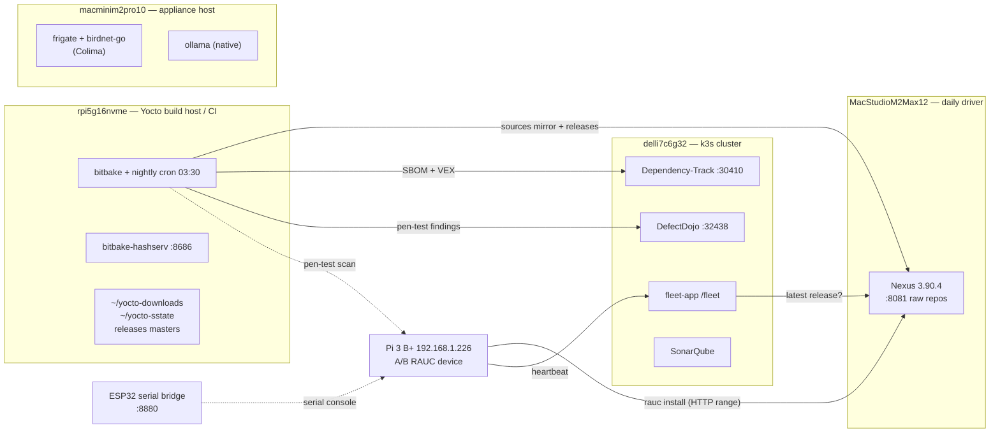

# Infrastructure — what runs where, and why

**Last verified:** 30 August 2026 (every endpoint and host below was probed, not
recalled).

**What this is:** the missing map. The other docs explain *how* a thing works
([rauc-ab-updates](rauc-ab-updates.md)), *why that tool*
([TOOLING.md](TOOLING.md)), or *what's not done* ([GAPS.md](GAPS.md)). This one
answers "which machine is that on, and what happens if it dies" — the questions
that cost real time to re-derive on 2026-08-30 when a Docker disk resize wiped a
host.

---

## The picture

---

## Hosts

| Host | Hardware | Role | Free disk |
|---|---|---|---|
| **MacStudioM2Max12** | M2 Max, 460 GB | Daily driver; Docker Desktop hosts **Nexus**; self-hosted GH Actions runner + buildx | ~59 GiB (87% used) |
| **rpi5g16nvme** | Pi 5, 16 GB RAM, 458 GB NVMe, Ubuntu 24.04 aarch64, 4 cores | **Yocto build host and the only CI** — there is no GitHub Actions build | ~220 GB (50%) |
| **delli7c6g32** | k3s cluster | Dependency-Track, DefectDojo, SonarQube, fleet-app | — |
| **macminim2pro10** | M2 Pro, 16 GB | Appliance host: frigate (NVR) + birdnet-go in Colima, **Ollama natively** | ~86 GiB |
| **Pi 3 B+** | `192.168.1.226`, MAC `b8:27:eb:58:38:6d` | The target device — A/B RAUC, dual rootfs | — |
| **ESP32 bridge** | `pi-serial-bridge.local` / `192.168.1.181` | Serial console over TCP `8880`; drops bytes on long bursts | — |

## Services

| Service | Host | Endpoint | Verified |
|---|---|---|---|
| Nexus (raw repos) | Mac Studio | `http://MacStudioM2Max12.local:8081` | 200 |
| Dependency-Track API | k3s | `:30410` — **scripts use this one** | 200 |
| Dependency-Track UI | k3s | `:30420` — browser only | 200 |
| DefectDojo | k3s | `:32438` | 302 |
| fleet-app | k3s | `http://delli7c6g32.local/fleet` | 200 |
| hashserv | Pi 5 | `localhost:8686` | — |

Nexus hosts three **separate** raw repos, and mixing them up has consequences:
`yocto-sources-raw` (mirror), `yocto-sstate-raw` (mirror, currently unused —
see below), and `schultz-releases-raw` (**the OTA origin — real data, not
cache**).

## Resource limits worth knowing

| Where | Limit | Actual |
|---|---|---|
| Docker Desktop (Studio) | 48 GB disk, 6 GiB RAM, 8 CPU, 2 GB swap | 21 GB real, 2.0 GB RAM |
| Nexus container | `mem_limit` 2560m; JVM `-Xms1200m -Xmx1200m -XX:MaxDirectMemorySize=1200m` | ~1.55 GB idle |
| Nexus blob store | 47.1 GB | 22.7 GB used, **22 GB free** |
| Colima (Mini) | 8 GiB RAM, 60 GB disk, 6 CPU, **no swap** | frigate 3.1 GiB + birdnet 0.9 GiB |

**`Docker.raw` is sparse** — 48 GB apparent, 21 GB real. The cap costs nothing
until used, so *growing* it is free and safe. **Shrinking destroys every volume**
(this is what wiped Nexus and SonarQube on 2026-08-30 — Docker Desktop cannot
resize down in place, it recreates the image).

## What is irreplaceable vs regenerable

The single most useful thing to know in an incident.

| Data | Where the master lives | If lost |
|---|---|---|
| **Release artifacts** (bundles, images, PROVENANCE) | `rpi5g16nvme:~/build-rauc/releases/<ver>/` | Re-publish to Nexus — this is what saved us on 2026-08-30 |
| **Signing keys** | gitignored `keys/` beside the repo | **Unrecoverable.** Devices trust that cert |
| **SBOM/VEX audit trail** | `rpi5g16nvme:~/build/sbom-archive/` | Unrecoverable history (GAPS I-6 — it sits in *scarthgap's* dir) |
| Source mirror | Nexus, refilled from `~/yocto-downloads` | Re-push (~3.5 min, 19 GB) |
| sstate | `rpi5g16nvme:~/yocto-sstate` | Rebuildable, slowly |
| `tmp/` build state | — | Fully regenerable from sstate |
| Nexus itself | compose file in git | Rebuildable; **no backup of its volume** (GAPS I-8) |

## Why things are placed where they are

Decided deliberately on 2026-08-30 after evaluating alternatives:

- **Nexus stays on the Mac Studio.** It must be independent of the build host,
  because the mirror exists to restore a build host that has been wiped — and
  because `schultz-releases-raw` is a *runtime* dependency for the fleet, so a
  build-host outage would otherwise take OTA down with it. That separation is
  not theoretical: recovery on 2026-08-30 worked **only because** Nexus and the
  release masters were on different machines.
- **Not the build host.** Beyond the above, a 4-core box running 5 000-task
  builds for hours would have Nexus competing for RAM and NVMe I/O during
  exactly the window the build saturates them.
- **Not the Mini**, despite 86 GiB free and SonarQube having moved out. Ollama
  runs *natively* there, so it competes for the same 16 GB from outside Colima:
  8 GiB VM + ~3 GB macOS + ~4 GB Ollama ≈ 15 of 16 GB, with **no swap in the
  VM** and frigate's usage growing. Adding a 2.5 GB JVM risks the OOM killer
  taking the camera NVR or an inference run. Counting only the VM's free RAM
  makes the Mini look roomier than it is.
- Relocating Nexus is otherwise **cheap and de-risked**: repointing
  `SOURCE_MIRROR_URL`/`SSTATE_MIRRORS` was measured to invalidate **zero**
  sstate (identical 5072/5080 restore counts), and the full rebuild path has
  been rehearsed end to end.

## Credentials — where, never what

All gitignored; none of these values belong in a commit, a log, or a chat.

| Secret | Location |
|---|---|
| Nexus admin | `the-docker-swarm-ai/infra/k3s/.credentials/nexus-admin-password` |
| Nexus write (`yocto-ci`) | `<workdir>/keys/nexus.env` on the build host; generated into `<workdir>/keys/nexus-write.env` on the Mac |
| Dependency-Track | `~/keys/dtrack.env` on the build host |
| DefectDojo | `~/keys/defectdojo.env` on the build host |
| RAUC signing | `keys/development-1.{key,cert}.pem` |

To move a secret between machines, pipe it over `ssh` **stdin** into a remote
rewrite — never as an argument (`ps`-visible) and never through stdout.

## The daily cycle

`daily-security-scan.sh`, cron **03:30** on the build host (this *is* the CI):

1. `git pull --ff-only` the repo, then the LTS layers for the active release
2. Preflight every endpoint — a stale URL costs seconds here, ~20 min at upload
3. `bitbake schultz-image-minimal`
4. SBOM + VEX → Dependency-Track
5. `build-rauc-bundle.sh` → A/B image + signed bundle, verified and archived
6. Pen-test → DefectDojo (opt-in, non-fatal)
7. Mirror **sources** → Nexus (sstate skipped by default — see
   [TOOLING.md](TOOLING.md#nexus-yocto-side-integration))

Which Yocto release all of this builds is one variable —
`SCHULTZ_RELEASE` in [scripts/release-profile.sh](../scripts/release-profile.sh),
currently `wrynose`. `SCHULTZ_RELEASE=scarthgap` is a complete, tested rollback
that needs no rebuild.
