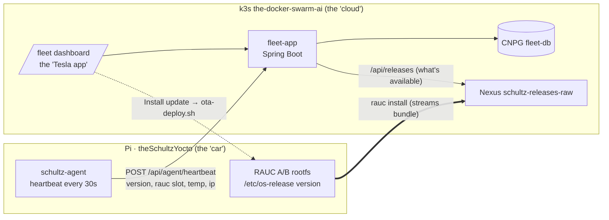

# Fleet management: a Tesla-style app for theSchultzYocto devices

This is the **product layer** on top of the platform: one screen that shows what
every device is doing — version, A/B boot slot, temperature, undervoltage, uptime
— and whether a newer release is available, with an **Install update** action.
The device is the "car"; the cluster is the "cloud"; the dashboard is the app.

The **app itself** (backend + web UI) is a cluster app and lives in
`the-docker-swarm-ai` — [`apps/fleet-app`](https://github.com/schultzzznet/the-docker-swarm-ai/tree/main/apps/fleet-app),
next to `loc8-app`/`talk-app`. This document covers the **device side that lives
here**: the `schultz-agent` that reports in, and how it reuses the OTA rails.

---

## The shape of it



Where the security tools answer *"is a device secure?"* (Dependency-Track +
DefectDojo), the fleet app answers *"is it alive, current and healthy — and
update it."* Same devices, complementary panes.

---

## The device agent (`schultz-agent`)

A ~200-line, **stdlib-only** Python service ([recipe](../recipes-support/schultz-agent/schultz-agent_1.0.bb),
[source](../recipes-support/schultz-agent/files/schultz-agent)) that every
`INTERVAL` seconds gathers and POSTs:

| Field | Source on the device |
|---|---|
| `deviceId` | `/etc/machine-id` (stable across reboots/OTA) |
| `currentVersion` / `imageId` | `/etc/os-release` (`IMAGE_VERSION` / `IMAGE_ID`) |
| `variant` | squashfs / read-only root ⇒ `hardened` |
| `bootSlot` / `raucBooted` | `rauc status` (A or B) |
| `socTempC` | `/sys/class/thermal/thermal_zone0/temp` |
| `undervoltage` | `vcgencmd get_throttled` (bits 0 / 16) |
| `uptimeSeconds` / `memUsePct` / `diskUsePct` | `/proc/uptime`, `/proc/meminfo`, `statvfs` |
| `ip` | primary route source address |

**Every probe degrades gracefully** — no `rauc`, no `vcgencmd`, no `/data` mount
just yields a null field, never a crash or a skipped heartbeat. (Verified: run
off-device with `/proc` absent and it still checks in, populating only what it
can read.)

### Putting it on a device

The agent is **opt-in** — the base `schultz-image-minimal` stays lean. Add it to
an image (it pulls in `python3`):

```bitbake
IMAGE_INSTALL:append = " schultz-agent"
```

Then point it at the fleet and set the shared token — edit
[`recipes-support/schultz-agent/files/schultz-agent.conf`](../recipes-support/schultz-agent/files/schultz-agent.conf)
(or drop overrides in `/etc/schultz-agent.conf` on the device):

```sh
FLEET_URL=http://delli7c6g32.local/fleet     # the fleet-app ingress
FLEET_TOKEN=<must match the fleet-agent-token Secret>
INTERVAL=30
```

`systemd` enables and supervises it (`Restart=always`); the unit is hardened
(`NoNewPrivileges`, `ProtectSystem=strict`) since the agent only reads and makes
one outbound call.

---

## OTA from the dashboard (visualize-first)

Clicking **Install update** in the dashboard records the target version and
returns the exact command to run on the build host:

```
scripts/ota-deploy.sh 2026.07.1 192.168.1.226 --reboot
```

That deliberately reuses the **proven** OTA path — [`ota-deploy.sh`](../scripts/ota-deploy.sh)
has RAUC stream the signed bundle straight from Nexus into the idle A/B slot,
with `panic=10` auto-rollback if it doesn't boot — rather than a new
device-initiated self-install. The dashboard makes the *state* (which version,
update available, which slot booted) visible; the OTA mechanism is unchanged.
Turning the button into a real trigger later is a single method in the app's
`OtaService`.

---

## Status

| Piece | Status | Notes |
|---|---|---|
| `schultz-agent` recipe + service | ✅ | running on the real Pi 3 B+ under systemd, heartbeating every 30 s |
| fleet-app (backend + dashboard) | ✅ | deployed to k3s (cosign-signed, 2/2 pods, CNPG `fleet-db`, `/fleet` ingress) |
| Nexus release listing | ✅ | live: `2026.07.1` / `2026.07.1-hardened` discovered; `latest` = mainline |
| End-to-end on real hardware | ✅ | 2026-07-14: agent image OTA'd to slot B; the Pi's card shows live in the dashboard |

The app + database deploy with `make deploy-fleet-k3s` (see the
[app README](https://github.com/schultzzznet/the-docker-swarm-ai/tree/main/apps/fleet-app));
build a fleet-enabled image with the `IMAGE_INSTALL:append` above and flash/OTA
it to light the first card up for real.

*See also:* [rauc-ab-updates.md](rauc-ab-updates.md) (the OTA it visualizes),
[security-and-auditing.md](security-and-auditing.md) + [pen-testing.md](pen-testing.md)
(the complementary "is it secure?" panes).
