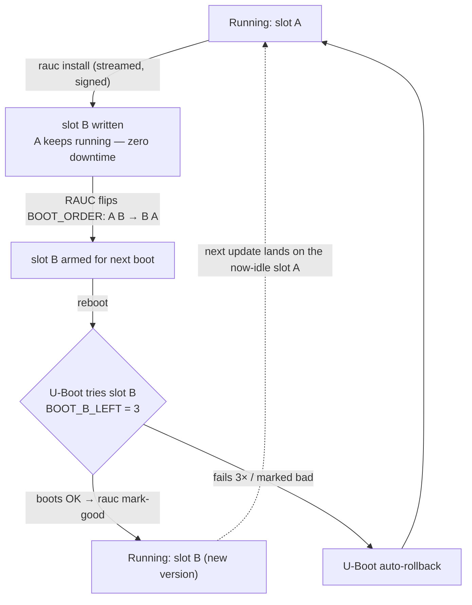
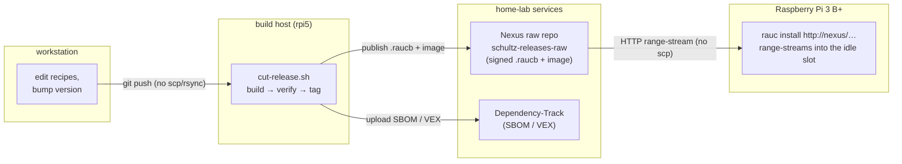

# RAUC A/B updates on the Raspberry Pi 3 B+

This is the real thing: **atomic, rollback-safe OTA updates** for
`schultz-image-minimal` on `raspberrypi3-64`, built on U-Boot + RAUC, adapted
from meta-rauc-community's `meta-rauc-raspberrypi` reference. It's the follow-on
to the plain single-partition image in [first-build.md](first-build.md).

> **Status (2026-07-06):** ✅ *verified end-to-end on real hardware* — booted on
> a Raspberry Pi 3 B+, updated **over the air** (`2026.07.0` → `2026.07.1`) with
> zero downtime, and rolled back on demand (serial slot trace `A → B → A`). The
> whole flow is scripted and git-synced (see "The automated flow" below); the
> numbered sections then walk the manual steps for understanding.

---

## The idea in one picture

Two complete copies of the rootfs (**slot A** and **slot B**). You're always
running one; updates are written to the *other*; a reboot switches over; if the
new one fails to boot, U-Boot automatically falls back. Nothing is ever patched
in place, so a bad update can't brick the device.

```
SD card (mmcblk0)
├─ p1  /boot   FAT   RPi firmware + u-boot.bin + kernel + dtbs   (shared)
├─ p2  rootfs_A  ext4   slot A  ← booted now
├─ p3  rootfs_B  ext4   slot B  ← next update lands here
├─ p4  /data     ext4   RAUC state + shared data        (survives updates)
└─ p5  /home     ext4   grows to fill the card

Boot flow:  RPi firmware → u-boot.bin → boot.scr
  reads env BOOT_ORDER="A B", BOOT_A_LEFT/BOOT_B_LEFT (tries, default 3)
  → picks the first slot with tries left, decrements it, boots that rootfs
  → boots with root=/dev/mmcblk0pN rauc.slot=X; the kernel is SHARED, loaded
    from the FAT /boot partition (only the rootfs is A/B in this reference)
  a successful boot resets the tries; running out of tries falls back to the other slot
```

`rauc` on the target flips `BOOT_ORDER` / resets the tries via `u-boot-fw-utils`
(`fw_setenv`), so the whole A/B decision lives in the U-Boot environment.

### The update + rollback lifecycle



---

## The automated flow (git-synced, no scp/rsync)

Three systems, three jobs — and **no `scp`/`rsync` anywhere**:

- **Git** — source of truth. Recipes/scripts reach the build host only via git
  ([sync-to-host.sh](../scripts/sync-to-host.sh) is git-over-ssh, or just
  `git push` + the host's `git pull`); each release is an annotated tag.
- **Nexus** (raw repo `schultz-releases-raw`, on the same Nexus that already
  backs our sstate/source mirror) — the **binary artifact store**. The signed
  `.raucb` bundle + A/B image live here; the device pulls from a stable URL.
- **Dependency-Track** — the **SBOM/VEX** (what's inside + CVE status). *Not* a
  binary store: the image bits never go here.



- **Cut a release** — bump `RAUC_BUNDLE_VERSION` (in
  [schultz-bundle.bb](../recipes-core/images/schultz-bundle.bb)) **and**
  `IMAGE_VERSION` (in [os-release.bbappend](../recipes-core/os-release/os-release.bbappend));
  they are the same CalVer `YYYY.MM.PATCH`. Commit + push, then:
  ```sh
  ssh rpi5g16nvme '~/theSchultzYocto/scripts/cut-release.sh'
  ```
  It git-pulls, builds the A/B image + signed bundle, verifies `rauc info` matches
  the version, snapshots the SBOM+VEX to Dependency-Track, archives
  bundle+image+SBOM+VEX+`PROVENANCE.txt` under `build-rauc/releases/<version>/`,
  **publishes them to the Nexus raw repo**, and tags `v<version>`.
- **Deploy it over the air** —
  ```sh
  ssh rpi5g16nvme '~/theSchultzYocto/scripts/ota-deploy.sh 2026.07.1 192.168.1.226 --reboot'
  ```
  The device runs `rauc install http://<nexus>/repository/schultz-releases-raw/…`
  and **streams** the signed bundle straight from Nexus into its inactive slot —
  Nexus honours HTTP range requests, so nothing lands on the Pi's disk (RAUC
  checks the signature as it streams). It then reboots and self-reports the new
  `IMAGE_VERSION` from `/etc/os-release`; the old slot stays as a one-reboot
  rollback. (`--local` falls back to an ephemeral HTTP server on the build host
  when Nexus is unreachable.)

The numbered sections below are the same flow done by hand, for understanding.

---

## Hardened variant (opt-in): squashfs + immutable root

For a fielded device (vs. the learning sandbox) there's a ready-made hardened
flavour, built from the same layer:
[schultz-image-hardened.bb](../recipes-core/images/schultz-image-hardened.bb) +
[schultz-bundle-hardened.bb](../recipes-core/images/schultz-bundle-hardened.bb).
It drops `debug-tweaks` (no empty root password / passwordless SSH), adds
`read-only-rootfs`, and ships the rootfs as **squashfs** — read-only at the
*format* level, so unlike ext4-mounted-read-only it cannot be `mount -o
remount,rw`'d. Nothing on the running root can be altered or persisted; a reboot
returns to the pristine image.

Cut it through the **same** pipeline (no hand-rolled bitbake — the scripts are
variant-aware via `SCHULTZ_BUNDLE`/`SCHULTZ_IMAGE`):

```sh
ssh rpi5g16nvme 'SCHULTZ_BUNDLE=schultz-bundle-hardened SCHULTZ_IMAGE=schultz-image-hardened \
  ~/theSchultzYocto/scripts/cut-release.sh'
```

That runs the **full** release: build → verify signature/version → **SBOM + VEX to
Dependency-Track** → archive + `PROVENANCE.txt` → **publish to Nexus** → annotated
git tag. Add `--no-publish`/`--no-tag` only to dry-run a variant before it's
boot-proven.

**Released + tracked (2026-07-07):** cut as `theSchultzYocto` **version
`2026.07.1-hardened`** — a signed verity bundle with a squashfs rootfs slot, its
**SBOM + VEX in Dependency-Track** (118 components, 56 findings once the VEX
auto-dismissed the Yocto-fixed CVEs), the bundle + image + SBOM + VEX + PROVENANCE
**published to Nexus**, and git tag **`v2026.07.1-hardened`**. The squashfs slot is
**35 MB vs the ext4 image's 164 MB**, and it sidesteps the `mkfs.ext4` gap (a
read-only image is just written to the slot). It **installs over the air** into a
`type=raw` slot — including **true HTTP-range streaming straight from Nexus**
(`ota-deploy.sh 2026.07.1-hardened <ip> --reboot`, no `--local`), verified on the
real Pi 3 B+ booting `/dev/mmcblk0p2 on / type squashfs (ro)`.

**What's wired now:**
- **`type=raw` slots** ([system.conf](../recipes-core/rauc/files/system.conf)) —
  RAUC rejects a squashfs image into an `ext4`-typed slot
  (`Unsupported image type 'squashfs' for slot type 'ext4'`); `raw` writes the
  slot block-for-block and accepts *both* the ext4 and squashfs images.
- **A login credential** — with `debug-tweaks` gone there is no empty root
  password, so [schultz-image-hardened.bb](../recipes-core/images/schultz-image-hardened.bb)
  bakes `../keys/authorized_keys` into `/root/.ssh` (root key auth works via
  sshd's default `PermitRootLogin prohibit-password`).

**The catch (proven the hard way):** OTA'ing the squashfs and rebooting **kernel-
panics** — `Unable to mount root fs on unknown-block(179,2)`. The A/B layout boots
a **single shared kernel from FAT `/boot`**, that kernel shipped SquashFS only as a
module (which can't be loaded before the root fs is mounted, and there's no
initramfs), and **a rootfs A/B OTA never updates the shared kernel**. Fix:
[linux-raspberrypi_%.bbappend](../recipes-kernel/linux/linux-raspberrypi_%.bbappend)
+ [squashfs.cfg](../recipes-kernel/linux/files/squashfs.cfg) build
`CONFIG_SQUASHFS=y` into the kernel — but since that kernel lives on the shared
`/boot`, the hardened squashfs image needs a **FRESH FLASH** of an SD image built
with it, *not* a rootfs-only OTA.

**The second catch (`rootfstype`):** even with the SquashFS kernel the first real
boot still panicked — meta-raspberrypi hard-codes `rootfstype=ext4` into the shared
`/boot/cmdline.txt`, so U-Boot pointing `root=` at the squashfs slot made the kernel
try to mount squashfs *as ext4* and fail. Fix:
[rpi-cmdline.bbappend](../recipes-bsp/bootfiles/rpi-cmdline.bbappend) sets
`CMDLINE_ROOT_FSTYPE = ""` so the kernel **auto-detects** the root fs (works for the
ext4 *and* the squashfs slot — both are built into the kernel).

**Auto-rollback (panic=10):** a failed hardened boot is rollback-safe on its own.
The kernel is built `CONFIG_CMDLINE_FROM_BOOTLOADER=y` (it ignores
`CONFIG_CMDLINE`, so the [cmdline.cfg](../recipes-kernel/linux/files/cmdline.cfg)
fragment is inert), so `panic=10` is appended to the U-Boot **bootargs** instead —
[rpi-u-boot-scr.bbappend](../recipes-bsp/rpi-u-boot-scr/rpi-u-boot-scr.bbappend)
overrides meta-rauc-raspberrypi's `boot.cmd.in` (our layer priority 10 wins) with
`setenv bootargs "... rauc.slot=${raucslot} panic=10"`. A boot that panics now
reboots after 10 s **without a human**; each retry decrements `BOOT_x_LEFT`, and
once the bad slot's attempts are exhausted U-Boot falls back to the good slot.

### Fresh-flash → go hardened (the working runbook)

The flashable base image (squashfs-capable kernel + `panic=10` boot script +
`type=raw` slots) is published to Nexus:

```sh
# 1. Pull the base image (any box that can reach Nexus)
curl -sfO http://MacStudioM2Max12.local:8081/repository/schultz-releases-raw/theSchultzYocto/base-images/schultz-ab-base-squashfs-kernel.wic.gz

# 2. Flash the SD (macOS: diskutil list to find the card; unmount; rdiskN = raw = faster)
diskutil unmountDisk /dev/diskN
gzip -dc schultz-ab-base-squashfs-kernel.wic.gz | sudo dd of=/dev/rdiskN bs=4m
sync

# 3. Boot the Pi on it → ext4 slot A, loginable (debug-tweaks). Then OTA the
#    immutable squashfs onto slot B straight from the build host's deploy dir:
ssh rpi5g16nvme 'SCHULTZ_BUNDLE_BASENAME=schultz-bundle-hardened \
  ~/theSchultzYocto/scripts/ota-deploy.sh 2026.07.1-hardened <pi-ip> --local --reboot'
```

The kernel on the freshly-flashed `/boot` now mounts SquashFS, so slot B comes up
on the **immutable** rootfs (loginable via the baked root key), with the ext4 slot
A as the rollback target and `panic=10` as the safety net.

**Proven end-to-end on the real Pi 3 B+ (2026-07-07):** flashed the base card →
booted ext4 slot A (`panic=10` live in `/proc/cmdline`) → `ota-deploy.sh
2026.07.1-hardened … --local --reboot` copied the squashfs to slot B → rebooted and
came up on **`/dev/mmcblk0p3 on / type squashfs (ro)`**, logged in via the baked key.
The first attempt also proved `panic=10`: before the `rootfstype` fix slot B
panicked, and the Pi auto-rebooted and rolled back to slot A on its own — no
power-cycle.

**Still open:**
- **Per-device SSH host keys.** `read-only-rootfs` bakes them at build time, so
  every device shares them; for per-device keys, persist `/etc/ssh` onto `/data`
  and regenerate on first boot. On the standard (ext4) image the opposite bites:
  each slot generates **its own** keys on first boot, so an A→B switch trips
  `REMOTE HOST IDENTIFICATION HAS CHANGED` on every workstation. Persisting
  `/etc/ssh` to `/data` fixes both ends of this.
- **U-Boot stays pinned at 2024.01 — cause of the 2025.04 failure unknown.**
  Upstream meta-rauc-community's newer `scarthgap` branch requires
  `lts-u-boot-mixin` (U-Boot 2025.04, which exists to support the RPi5). Tried on
  the real Pi 3 B+ 2026-08-19: it boots, but `boot.scr` never takes effect —
  `/proc/cmdline` holds the VideoCore firmware's args, so no `rauc.slot=`, no
  `panic=10`, and no `BOOT_ORDER` handling. Slot selection and rollback are gone
  while `rauc status` still reports both slots "good". Reverted. It is **not**
  simply bootstd: 2024.01 also runs `bootcmd=bootflow scan` and does source
  `boot.scr`, so the difference is elsewhere in 2025.04's `rpi_arm64_defconfig`.
- **OTA-able kernels.** Upstream's newer `boot.cmd.in` loads the kernel from the
  A/B rootfs (`load ${BOOT_DEV} … boot/Image`) instead of `fatload`-ing the shared
  one — that's what their U-Boot SquashFS patch is for. Adopting it would make
  kernel updates shippable as bundles instead of card swaps. The bootloader
  itself can never be A/B here: the Pi 3 boot ROM always loads the first FAT
  partition, and `RAUC_BUNDLE_SLOTS = "rootfs"` carries no `/boot` image.

**Operational gotcha (verified 2026-08-19):** after `rauc status mark-bad`,
running `mark-good other` is **not** enough to restore the other slot. It resets
`BOOT_x_LEFT` but leaves the slot out of `BOOT_ORDER`, and RAUC's U-Boot backend
reports any slot missing from `BOOT_ORDER` as `bad` — so you end up single-slot
with no fallback. Use `rauc status mark-active other`, which rewrites
`BOOT_ORDER=A B` and makes that slot the next boot.

**Stronger still (follow-on):** put the squashfs on **dm-verity** for continuous
runtime integrity (every block hash-checked against a signed root) — that turns
"immutable" into "immutable *and* tamper-evident". More than a one-liner (needs an
initramfs + the verity setup); the natural next tier once boot is proven.

---

## 1. Build it

On the build host (this uses a **separate `build-rauc/`** dir so it never
disturbs the normal `build/` the daily scan uses):

```sh
./theSchultzYocto/scripts/setup-rauc-build.sh   # adds the rauc layers + U-Boot/systemd/dual-wic config
cd build-rauc
bitbake schultz-image-minimal   # → tmp/deploy/images/raspberrypi3-64/schultz-image-minimal-*.wic.bz2
bitbake schultz-bundle          # → schultz-bundle-raspberrypi3-64.raucb (signed update)
```

What the setup script layered on top of the normal config:
`RPI_USE_U_BOOT=1`, `ENABLE_UART=1`, `INIT_MANAGER=systemd`,
`WKS_FILE=sdimage-dual-raspberrypi.wks.in`, and `IMAGE_FSTYPES += ext4`. (This
scarthgap-era reference boots a shared kernel from `/boot`; only the rootfs is
A/B.) The A/B slots + our signing keyring come
from [recipes-core/rauc/](../recipes-core/rauc/); the bundle's `compatible`
string is pinned in [schultz-bundle.bb](../recipes-core/images/schultz-bundle.bb)
to match `system.conf` (a mismatch is the #1 reason `rauc install` refuses a
bundle).

**…or let it build itself.** You don't have to run those `bitbake` lines by
hand. [build-rauc-bundle.sh](../scripts/build-rauc-bundle.sh) runs the whole
image → bundle → **verify** → archive cycle, and the nightly
[daily-security-scan.sh](../scripts/daily-security-scan.sh) chains it as its
final stage (under the same one-build-at-a-time lock). So every recipe or CVE
change that refreshes `build/` also refreshes the flashable A/B image **and** the
signed bundle in `build-rauc/`, automatically. Each run verifies the bundle's
signature + `compatible` string *before* archiving it under a UTC timestamp in
`build-rauc/rauc-archive/` and repointing the stable `latest.*` symlinks — so
grabbing the freshest card never means chasing a timestamp:

```sh
scp <build-host>:build-rauc/rauc-archive/latest.wic.gz .   # newest A/B image
scp <build-host>:build-rauc/rauc-archive/latest.raucb  .   # newest signed bundle
```

Run it standalone any time with `./theSchultzYocto/scripts/build-rauc-bundle.sh`.
Skip it inside a scan with `SCHULTZ_BUILD_RAUC=0`; keep more/fewer archived sets
with `RAUC_ARCHIVE_KEEP=N` (default 5).

## 2. Flash it

Same as the plain image, but note it's now a **5-partition** card. Both A and B
are written with the same rootfs at flash time, so either can boot from the
start.

The build emits a **gzip**-compressed `.wic.gz` (not bzip2 — balenaEtcher
decompresses gzip *many* times faster than bz2, which is what made flashing feel
like it hung) alongside a `.wic.bmap`. Fastest option first:

```sh
# FASTEST — bmaptool writes only the used blocks and verifies as it goes; it
# auto-picks up the sibling .wic.bmap. (macOS: pipx install bmaptool;
# Debian/Ubuntu: sudo apt install bmap-tools.)
bmaptool copy schultz-ab-image.wic.gz /dev/rdiskN

# balenaEtcher: just point it at the .wic.gz — gzip unpacks quickly.

# Plain dd, decompressing on the fly (no bmap):
zcat schultz-ab-image.wic.gz | sudo dd of=/dev/rdiskN bs=4m

# Still holding the older .wic.bz2 and don't want to wait on Etcher? Unpack it
# once and flash the raw .wic (then Etcher/dd has nothing to decompress):
#   bunzip2 -k schultz-ab-image.wic.bz2   # -> schultz-ab-image.wic
```

> **Why a `.wic` and not an `.iso`?** An `.iso` (ISO 9660) is a read-only
> *optical-disc* filesystem; PC install ISOs boot through BIOS/UEFI El Torito. A
> Raspberry Pi doesn't boot that way — its GPU firmware reads a **FAT partition
> off a partitioned SD card**, so it needs a *raw disk image with a partition
> table*. That is exactly what a `.wic` is (here: 5 partitions — boot + rootfs
> A/B + data + home); an `.iso` simply wouldn't boot on a Pi. So the only real
> choice is the *compression wrapper* around the `.wic`, and we switched it from
> bzip2 to **gzip** to keep flashing quick. The `.bz2` you flashed earlier was
> perfectly valid — just slow to decompress.

## 3. First boot — with the serial console attached

This is where the serial console earns its keep (see
[serial-console.md](serial-console.md)). Power on and watch U-Boot:

```
...
Found valid RAUC slot A
...
schultz-image-minimal login:
```

Log in (`root`, empty password on a debug-tweaks build) and confirm RAUC sees
the bootloader and both slots:

```sh
rauc status
# Expect: booted slot 'A' (rootfs.0), the other slot 'B' (rootfs.1),
#         boot status good, and no keyring errors.
```

If `rauc status` shows the slots and a booted slot, the hard part works.

## 4. Do an update (A → B)

Build a fresh bundle (bump something first so you can tell the versions apart —
e.g. edit the image, or just rebuild), copy it to the Pi, and install:

```sh
# on the workstation / build host
scp schultz-bundle-raspberrypi3-64.raucb root@<pi-ip>:/tmp/

# on the Pi
rauc install /tmp/schultz-bundle-raspberrypi3-64.raucb   # writes to the INACTIVE slot (B)
reboot
```

After reboot, `rauc status` should show **booted slot 'B'**. You just did an
atomic OTA update — the running system was never touched, only the spare slot.

## 5. Prove the rollback

The safety net: if a freshly-installed slot can't boot, U-Boot exhausts its 3
tries and falls back to the known-good slot. To see it deliberately, mark the
current slot bad and reboot:

```sh
rauc status mark-bad          # marks the running slot as bad
reboot                        # U-Boot should boot the OTHER slot instead
```

`rauc status mark-good` (or a clean successful boot) restores confidence in a
slot. This is the whole point of A/B: **a bad update degrades to the previous
one instead of bricking.**

---

## Why the bundle is trusted (and only ours)

- The bundle is signed with `development-1.key.pem`
  (`scripts/generate-signing-keys.sh`, private half kept out of the repo).
- The device's keyring is `development-1.cert.pem`, installed to `/etc/rauc/`
  and referenced by `system.conf`'s `[keyring]`. `rauc install` verifies the
  signature against it, so **only bundles we signed are accepted**.
- The bundle and the system must share the same `compatible`
  (`theSchultzYocto-raspberrypi3-64`) — RAUC's guard against flashing a bundle
  built for a different device.

## Secure boot vs. signed updates — where the line honestly is

These sound similar and get conflated constantly. They are not the same thing,
and one of them the Pi 3 simply cannot do:

- **Signed, integrity-checked updates — yes, we have this.** `rauc install`
  verifies the bundle's signature against the on-device keyring and refuses
  anything we didn't sign, and the `verity` bundle format gives dm-verity
  block-level integrity of the slot's contents. That is real *update*
  authenticity + integrity: an attacker can't push you a tampered or
  third-party update.
- **Hardware secure boot — no, and not on this board.** "Secure boot" proper is
  a *verified chain* from the SoC boot ROM → bootloader → kernel, rooted in keys
  fused into the chip. The Raspberry Pi 3's boot ROM loads `bootcode.bin` /
  firmware / `u-boot.bin` from the FAT partition **unsigned** — there is no key
  fusing and no signature check anywhere in its boot path. Anyone with physical
  access to the SD card can alter `/boot` (or the rootfs) and the Pi will boot
  it. This is a **hardware ceiling, not a configuration gap**: only Pi 4/5 have
  even a limited signed-boot (bootloader EEPROM + a fused key), and full
  measured/attested boot wants a TPM the Pi 3 doesn't have.

The accurate one-liner: **RAUC here gives you update security (only your signed,
integrity-checked bundles install onto verified A/B slots), not boot-chain
attestation.** If this ever moves to a Pi 4/5, signed-boot becomes a real thing
to layer underneath; on a Pi 3 it's out of reach and worth stating plainly
rather than implying otherwise.

## Troubleshooting (serial console is your friend)

| Symptom | Likely cause / fix |
|---|---|
| Black screen, nothing on serial | RPi firmware not finding `u-boot.bin` / bad flash → re-flash; check the FAT partition has `u-boot.bin` + `config.txt` |
| U-Boot loops "No valid RAUC slot found" | both slots out of tries → it resets tries to 3 and retries; if persistent, the kernel/rootfs in the slot isn't booting (watch the kernel log) |
| `rauc install` → "compatible mismatch" | bundle `RAUC_BUNDLE_COMPATIBLE` ≠ system `compatible` — both must be `theSchultzYocto-raspberrypi3-64` |
| `rauc install` → signature/keyring error | device keyring isn't the cert that signed the bundle — rebuild the image so `/etc/rauc/development-1.cert.pem` matches your signing key |
| `rauc install` → "failed to run mkfs.ext4" at ~99% | the minimal image ships no `mkfs.ext4` (no `e2fsprogs-mke2fs`, no package manager). Fixed by shipping the rootfs as a raw `ext4` image (`RAUC_SLOT_rootfs[fstype]="ext4"` in [schultz-bundle.bb](../recipes-core/images/schultz-bundle.bb)) so RAUC writes it block-for-block instead of formatting+extracting a tar. Small-bundle alternative: add `e2fsprogs-mke2fs` to the image `IMAGE_INSTALL` and keep the tar |
| Update installs but won't boot | that's the rollback case — let it fall back to the good slot, then debug the new slot over serial |

## Honest caveats

- This follows a *demo* reference layer; it's a great learning setup, not a
  hardened production update system (no bootloader-env redundancy, dev keys,
  single SD card).
- A/B doubles rootfs space — fine on any reasonable SD card for this minimal
  image, but worth knowing.
- Everything here is built and internally consistent; the boot/rollback
  behaviour is confirmed *by you, on the board, over serial*. There is genuinely
  no substitute for that last step — which is the fun part.
