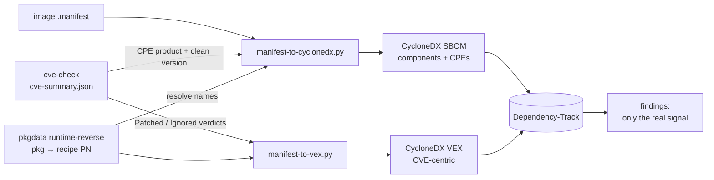

# Yocto, explained (with this repo as the running example)

## What Yocto actually is

**Yocto Project is not a Linux distro.** It's a build framework — BitBake (the
task-execution engine) plus a big pile of metadata (recipes, classes, config
files) organized into **layers** — whose job is to let you construct *your
own* distro for embedded/custom hardware. When people say "I built a custom
Yocto image," what they mean is: they used this framework to assemble one.

The pieces, concretely:

- **BitBake** — the engine. Reads recipes, resolves a dependency graph,
  executes tasks (fetch, patch, configure, compile, install, package...) in
  the right order, in parallel where possible. Analogous to `make`, but
  distro-scale and cross-compilation-first.
- **OpenEmbedded-Core (OE-Core)** — the foundational layer of metadata:
  toolchain recipes, core Unix userland, base classes almost everything else
  builds on.
- **Poky** — a *reference distribution*: BitBake + OE-Core + a default distro
  policy (`meta-poky`) + reference machines (`meta-yocto-bsp`, mostly QEMU
  targets). It's a sane, working starting point, not "the" Yocto distro.
- **Layers** (`meta-*`) — modular, stackable collections of recipes. Convention
  over configuration: everything is a layer, including your own customizations.
  In this repo, `meta-raspberrypi` is the Raspberry Pi hardware-support layer,
  and this whole repo *is* our own layer (collection name `schultz`, see
  [conf/layer.conf](../conf/layer.conf)).
- **Recipes** (`.bb` files) — build instructions for one piece of software:
  where to fetch it, how to configure/compile/install it, what it depends on,
  what license it's under. [recipes-core/images/schultz-image-minimal.bb](../recipes-core/images/schultz-image-minimal.bb)
  is a recipe — just one whose "output" is a whole root filesystem image
  instead of a single package.
- **Classes** (`.bbclass`) — shared behavior recipes inherit (`inherit
  cve-check`, `inherit systemd`, etc.) instead of repeating logic everywhere.
- **Machine config** — hardware target definition (kernel, bootloader,
  architecture tuning). `raspberrypi3-64` comes from `meta-raspberrypi`.
- **Distro config** — cross-cutting policy: init system, package manager
  format, default features. We use the stock `poky` distro
  (`DISTRO = "poky"` in [local.conf.sample](../conf/templates/schultz/local.conf.sample)).

## How you actually make a distro

Assembling a distro is choosing/writing five things, in practice:

1. **Pick your layers.** Start from OE-Core + a distro policy (Poky is the
   easy default), add a BSP layer for your hardware
   (`meta-raspberrypi`), add feature layers as needed (`meta-openembedded`
   for a much bigger package catalog, `meta-virtualization`,
   `meta-security`, hundreds more exist — browse
   [layers.openembedded.org](https://layers.openembedded.org/)).
2. **Create your own layer.** This is where *your* distro's identity lives —
   your custom recipes, your image definition, any patches/overrides to
   upstream recipes. `bitbake-layers create-layer` scaffolds one; ours was
   built by hand but the shape is the same (`conf/layer.conf` +
   `recipes-*/` directories).
3. **Pick a MACHINE.** Which hardware you're targeting — determines kernel,
   bootloader, architecture. Ours: `raspberrypi3-64`.
4. **Write an image recipe.** An image recipe is just `IMAGE_INSTALL` (what
   packages go in) plus `IMAGE_FEATURES` (feature bundles like
   `ssh-server-openssh`, `debug-tweaks`, `read-only-rootfs`). Ours extends
   `core-image-minimal` and adds SSH — see
   [schultz-image-minimal.bb](../recipes-core/images/schultz-image-minimal.bb).
   This is also where "minimal" stops being a marketing word and becomes a
   real design decision: every package you add is a package you now have to
   maintain, patch, and justify.
5. **Build and iterate.** `bitbake <image>` builds the whole thing; `devtool`
   gives you a fast edit/rebuild loop on one recipe at a time without
   rebuilding the world; `bitbake-layers show-layers`/`show-recipes` tell you
   what's actually in play. Shared state (`sstate-cache`) means rebuilds
   after the first one are fast — only what changed gets rebuilt.

The whole "is this actually available" question matters more than it sounds:
we found out the hard way that `nano`/`htop` aren't in OE-Core or
`meta-raspberrypi` — they're in `meta-openembedded`, a layer we don't have.
Every package you reference has to actually be *provided* by one of your
configured layers, or BitBake fails fast (`Nothing RPROVIDES 'x'`) rather than
silently substituting something.

## Why this is a smart way to do it

Compared to "take a general-purpose distro (Debian/Ubuntu/Raspberry Pi OS)
and strip it down" or "hand-roll a rootfs from scratch":

- **Reproducibility.** Same layers + same config + same recipes = bit-for-bit
  the same image, on any build host. No "works on my machine" for the OS
  itself.
- **Actually minimal, not diet-general-purpose.** You start from nothing and
  add only what you choose (`IMAGE_INSTALL`), rather than starting from
  everything a general distro ships and trying to delete your way to small.
  Smaller image = smaller attack surface, less to patch, less to explain.
- **Cross-compilation is the default, not an afterthought.** Build for
  `arm64`, `armv7`, `riscv64`, whatever, from any host architecture, using
  the same workflow every time.
- **License visibility is built in, not bolted on.** Every recipe declares
  `LICENSE`. Anything with a restrictive/non-free flag (like the RPi
  Wi-Fi/Bluetooth/GPU firmware we hit) requires an explicit
  `LICENSE_FLAGS_ACCEPTED` — you can't accidentally ship something whose
  license you didn't look at.
- **It's what the industry actually runs.** Automotive, networking gear,
  industrial control, most "embedded Linux products" you can name are built
  this way — meaning long-term vendor support, a large layer ecosystem, and
  transferable skills.
- **The tradeoff, honestly:** steeper learning curve than Buildroot (simpler,
  Makefile/Kconfig-based, less flexible layering) and much steeper than
  "just apt-get on Raspberry Pi OS." You're paying setup/learning cost for
  control and reproducibility. For a one-off hobby project that's a real
  cost; for anything you'll maintain for years, or need to trust, it's a
  good trade.

## Keeping it updated

Yocto ships releases on a rhythm (see the [Releases wiki](https://wiki.yoctoproject.org/wiki/Releases)):
non-LTS releases roughly every 6 months, LTS releases roughly every 4 years
with multi-year support tails. `scarthgap` (5.0 LTS, supported into 2028) was
this project's first pin — see [first-build.md](first-build.md) — and
`wrynose` (6.0 LTS, supported into 2030) is the migration target described
below.

Updating means moving **all your layers together** to matching release
branches — the core layer, `meta-raspberrypi`, and your own layer's
`LAYERSERIES_COMPAT` all need to agree, or BitBake will refuse to parse.
Practically: read the release's migration notes, bump branches, rebuild, fix
what breaks (recipe renames, removed classes, changed defaults do happen
between releases — see "The wrynose migration" below for a real one).

For patching *within* a release rather than jumping releases:

- Recipes pin exact versions (`PV`) and often exact source revisions
  (`SRCREV`) — nothing moves under you silently. Getting a fix means someone
  (upstream layer maintainers, or you) bumps that pin.
- `devtool upgrade <recipe>` automates a lot of the "bump version, refresh
  patches, see what broke" cycle for one recipe at a time.
- The upstream Yocto/OE-Core and `meta-raspberrypi` projects continuously
  backport fixes to their LTS branches — `git pull` on those layers
  periodically, not just at major-version-jump time.

## The wrynose migration: where `poky` went, and how this was rebuilt

Yocto 6.0 (`wrynose`) is a genuine structural break from every release before
it, not just a new codename — worth understanding on its own, because "bump
the branch name" (which is *all* scarthgap → any-earlier-release ever took)
stopped working.

### `poky` is retired

Every release through `scarthgap` was fetched as a single convenience repo,
**`poky`**, which bundled three independent projects into one clone:

| Inside old `poky/` | Actually is | Upstream repo now |
|---|---|---|
| `poky/meta/` | the core recipe set | `openembedded-core` |
| `poky/bitbake/` | the build engine | `bitbake` |
| `poky/meta-poky/`, `poky/meta-yocto-bsp/` | the reference distro + BSP | `meta-yocto` |

The Yocto Project stopped maintaining that bundle after scarthgap —
`git.yoctoproject.org/poky`'s `master` branch carries a commit literally
titled *"The poky repository master branch is no longer being updated"*
(Nov 2025), and no `wrynose` branch was ever cut there. wrynose ships as the
three repos above, cloned as **separate siblings**, plus BitBake tracks a
version number now (`2.18`) instead of a codename. `oe-init-build-env` still
exists and works the same way — it just now lives in `openembedded-core/`
instead of `poky/`.

`scripts/fetch-layers.sh` clones all three (plus `meta-raspberrypi` and
`meta-rauc`, which kept their usual codename-branch convention).

### Recipe-level breaking changes hit in this migration

Concrete things that failed on the first wrynose build attempt, in the order
BitBake surfaced them:

- **`inherit cve-check` is gone.** Replaced by `sbom-cve-check`
  (`OE_FRAGMENTS += "core/yocto/sbom-cve-check"`), which analyses the SPDX SBOM
  `create-spdx` already produces instead of re-scanning at build time. Its
  output — `<image>.sbom-cve-check.yocto.json` in `DEPLOY_DIR_IMAGE` — uses the
  *same* `package[].issue[]` shape as the old `cve-summary.json`, so
  [scripts/manifest-to-cyclonedx.py](../scripts/manifest-to-cyclonedx.py) and
  [scripts/manifest-to-vex.py](../scripts/manifest-to-vex.py) needed **zero**
  changes — only the scripts that locate the file did.
- **`S = "${WORKDIR}"` is a hard parse error now** ("no longer supported") —
  [schultz-agent's recipe](../recipes-support/schultz-agent/schultz-agent_1.0.bb)
  used it for a `file://`-only fetch with no real source tree; the fix is
  `S = "${UNPACKDIR}"`.
- **`debug-tweaks` (the `IMAGE_FEATURES` bundle) was split** into its
  constituent features (`allow-empty-password`, `allow-root-login`) — the
  bundle name itself is no longer valid and BitBake now tells you the whole
  list of what *is* valid when you get it wrong.
- **`.wks` kickstart files must live under `files/wic/`** in whichever layer
  provides them (used to be anywhere BitBake's WKS search path covered).
  `meta-rauc-community`'s upstream `master` branch (the one that targets
  wrynose — see below) already conforms; nothing to fix on our side.

### The RAUC A/B layer needed a compatibility check of its own

`meta-rauc-community` has no `wrynose`-named branch — like `meta-yocto`,
it tracks the *current* release on `master`
(`LAYERSERIES_COMPAT_meta-rauc-raspberrypi = "wrynose"`, confirmed by reading
its `layer.conf` before touching anything). Two things worth knowing before
trusting that:

- Its `master` branch **dropped the `lts-u-boot-mixin` hard dependency** that
  broke A/B silently the last time this project tried a newer U-Boot on
  scarthgap (see [rauc-ab-updates.md](rauc-ab-updates.md#still-open) and
  [TOOLING.md](TOOLING.md#rauc)) — a genuinely different, cleaner
  `LAYERDEPENDS` this time.
- But oe-core/wrynose ships **U-Boot 2026.01 natively** — two major versions
  past the known-good 2024.01 this project ran on scarthgap, and newer still
  than the 2025.04 that caused the earlier silent failure. Same class of risk,
  different version, and *not optional* this time (it's wrynose's stock
  U-Boot, not an opt-in mixin) — which is exactly why this still needs an
  on-hardware boot + rollback test before it's trusted, not just a green
  build. See [status.md](status.md) for the current verification state.

### The isolation lesson (learned the hard way, 2026-08-29)

`meta-raspberrypi` and `meta-rauc` are **shared sibling directories** — every
build directory's `bblayers.conf` points at the *same* `~/meta-raspberrypi`
and `~/meta-rauc` on disk. Switching those two directories to `wrynose` for
testing broke the **still-scarthgap production nightly cron** twice in one
day, because `build/` and `build-rauc/` reference those same paths:

```
ERROR: Layer raspberrypi is not compatible with the core layer which only
       supports these series: scarthgap (layer is compatible with wrynose)
```

and, after fixing that, a second break from shared *scripts* (not
directories) pointing at the wrong `oe-init-build-env`:

```
bb.parse.ParseError: ... Could not include required file conf/multiconfig/.conf
```

(wrynose's BitBake 2.18, sourced via `openembedded-core/oe-init-build-env`,
parsing scarthgap-era `conf/` files it was never meant to read.)

The fix, and the pattern this project now follows for any two-release-wide
migration: **while a release is being validated, it gets its own, entirely
separate clone of every layer it needs** — never share a directory between a
release that's still in production and one that's still being proven. Every
migration script now carries a loud warning about this (see the header of
[scripts/fetch-layers.sh](../scripts/fetch-layers.sh)). Concretely, three
parallel trees exist on the build host right now:

| Tree | Layers | Purpose |
|---|---|---|
| `~/poky`, `~/meta-raspberrypi`, `~/meta-rauc` (scarthgap) | shared, production | `build/` (nightly scan) and `build-rauc/` (nightly A/B bundle) |
| `~/openembedded-core`, `~/bitbake`, `~/meta-yocto`, `~/wrynose-layers/{meta-raspberrypi,meta-rauc}` (wrynose) | isolated | `build-wrynose/` — plain image, proven (5080/5080 tasks, SBOM/VEX verified end-to-end) |
| `~/wrynose-layers/meta-rauc-community` (wrynose-compatible `master`) | isolated | `build-rauc-wrynose/` — A/B image + signed bundle, verified on hardware 2026-08-30 |

### Current status

Both halves are done and proven on real hardware.

The **base image** migration: a clean 5080-task build, CVE/SBOM/VEX pipeline
verified component-for-component against the scarthgap output (81 components,
79 with CPE either way).

The **A/B/RAUC** migration (verified 2026-08-30 on the Pi 3 B+): U-Boot
**2026.01** turned out to be fine where 2025.04 was not — it sources `boot.scr`,
so the booted slot carried `root=/dev/mmcblk0p2 rauc.slot=A panic=10`, and the
full rollback trace worked: `mark-bad` → `BOOT_ORDER=B` → reboot into
`root=/dev/mmcblk0p3 rauc.slot=B` (with A correctly reported `bad`) →
`mark-active other` → back to A with both slots `good` and tries restored 3/3.
That narrows the earlier regression to 2025.04/`lts-u-boot-mixin` specifically
rather than "newer U-Boot" generally.

Two genuine bugs surfaced on the way there, both worth remembering:

- **The bundle was signed with upstream's public demo key.**
  `meta-rauc-community`'s `layer.conf` sets `RAUC_KEY_FILE ?=` and
  `RAUC_CERT_FILE ?=` pointing at its own example keys. Every `layer.conf`
  parses *before* any recipe, so our recipe's `?=` never fired and the bundle
  verified as `CN = Test Org Development-1`. Anything security-relevant gets an
  unconditional `=`. (No device was ever at risk — the on-device keyring is
  still our own cert, so a demo-signed bundle would simply have been rejected.)
- **Root login was impossible.** `debug-tweaks` is a bundle of *three*
  features; replacing it with explicit ones missed `empty-root-password`.
  Without that, image postprocessing forces an unknown random password into
  `/etc/shadow` — so serial *and* SSH both reject a login that no password can
  satisfy, even though `allow-empty-password` and `allow-root-login` are set.

**Production still stays on scarthgap** — nightly `build/` and `build-rauc/`,
and every production-shared script still points at `poky/`. The remaining step
is a deliberate cutover decision, not a technical unknown. See
[status.md](status.md) and [GAPS.md](GAPS.md) for the up-to-date verification
state.

## Safe and secure, concretely

- **`inherit cve-check`** (scarthgap) / **`sbom-cve-check`** (wrynose, see
  above) — a standard OE-Core class that cross-references
  every recipe's version against the NVD CVE database and reports known
  vulnerabilities per-package at build time (`tmp/deploy/cve/` reports).
  This is the single most useful "am I shipping something known-bad" check
  and it's not extra tooling to bolt on, it's already in the framework.
- **Minimal `IMAGE_INSTALL` = minimal attack surface**, by construction, not
  by after-the-fact hardening. Nothing is running or installed that you
  didn't explicitly ask for.
- **`LICENSE_FLAGS_ACCEPTED`** forces a conscious decision before anything
  non-free/restrictively-licensed ships — you can't silently end up
  distributing something you haven't reviewed.
- **`IMAGE_FEATURES += "read-only-rootfs"`** is available when you're ready
  for it — a read-only root filesystem meaningfully limits what a runtime
  compromise can persist or tamper with. Not enabled here (this image is a
  debug/learning sandbox, deliberately loose via `debug-tweaks`), but it's a
  one-line feature away for anything closer to production.
- **Reproducible builds** double as a supply-chain check: if you can rebuild
  the same inputs and get the same output, you have a real basis for
  verifying "what's actually in this image" rather than trusting a binary
  blob.
- **Deeper topics that exist but aren't set up here** (worth knowing the
  names for later): secure boot / verified boot chains, `meta-secure-core`,
  dm-verity/IMA integrity measurement, signed package feeds. All real,
  all more involved than this learning project needs yet.

### Deciding what the image can even *do* — attack-surface hardening

"Minimal `IMAGE_INSTALL`" above is the easy half. The stronger question is which
*capabilities* a given image physically has — and Yocto lets you decide that at
four layers, from "absent from this build" (strongest) to "present but policed":

1. **`DISTRO_FEATURES` / `MACHINE_FEATURES`** — the master switches. Removing a
   feature makes hundreds of recipes build *without* that support (they key off
   it via `PACKAGECONFIG`): `DISTRO_FEATURES:remove = "bluetooth wifi"` → no
   BlueZ, no wpa-supplicant compiled anywhere. Deeper than not-installing a
   package — the support never enters the build graph.
2. **Kernel config** — the "can never be used" guarantee. No driver = inert
   hardware even if the chip is on the board. A `.cfg` fragment via a
   `linux-raspberrypi` bbappend flips a driver to `n` (gone), `m` (module,
   blacklistable) or `y`: `# CONFIG_USB_STORAGE is not set` and that image
   literally cannot mount a USB stick.
3. **Device tree / `config.txt`** — the Pi-native bus switches, *below* the OS:
   `dtoverlay=disable-bt`, `dtoverlay=disable-wifi`, `dtparam=i2c_arm=off`,
   `dtparam=spi=off`, `enable_uart=0`.
4. **Runtime gating** — `modprobe` blacklist, udev rules, USBGuard allow-lists.
   Weakest (defense-in-depth); doesn't remove the capability, just polices it.

The **`IMAGE_FEATURES`** knobs sit alongside these: `debug-tweaks` (empty root
password + passwordless SSH — great for the bench, unacceptable for a locked-down
build) and `read-only-rootfs`.

Because each release is an immutable, **signed A/B image with a stamped
`IMAGE_VERSION`**, the capability set becomes *part of the version*: a device on
a hardened release provably can't do what was compiled out, and an auditor can
read the kernel `.config` + `config.txt` straight from that release's
`PROVENANCE.txt`. The concrete, opt-in knobs (all **OFF** by default) are
documented in [local.conf.sample](../conf/templates/schultz/local.conf.sample)
under "attack-surface hardening" — the controlled config *is* `local.conf`, no
custom tooling.

**One Pi 3 B+ gotcha:** its Ethernet NIC is *itself* a USB device (the LAN7515
is a USB hub + USB-attached NIC), so disabling USB host wholesale also kills
`eth0` → SSH → OTA. Drop USB **mass storage** only; never USB host. (A Pi 4/5
separates them.)

## Fitting into a real toolchain: git, Nexus, Dependency-Track

### Git — it's already doing more than you think

Beyond hosting our layer, git is also the fetch mechanism for a big chunk of
*upstream* source: most recipes use `SRC_URI = "git://...;branch=..."` with a
pinned `SRCREV`, so a huge amount of what BitBake fetches is a git operation
under the hood, version-pinned per recipe.

Managing many layers (each its own git repo, each needing a matching release
branch) gets painful with raw submodules. The community answer is
**[kas](https://kas.readthedocs.io/)** — a YAML manifest that declares your
layers, branches, and patches, and sets up the whole build environment in one
command. `meta-raspberrypi` ships its own `kas-poky-rpi.yml` for exactly this
reason. Google's `repo` tool (Android-style multi-repo manifests) is the
other common option. Worth adopting once you're juggling more than 2-3
layers — not needed yet here.

What deliberately stays *out* of git either way: `build/`, `downloads/`,
`sstate-cache/`, `tmp/` — huge, host-specific, and fully reproducible from
recipes + config. Already in [.gitignore](../.gitignore).

### Nexus — shared caches and artifact storage

(Artifactory was evaluated first and rejected — Java-only on the free tier,
and its Bintray-based install docs point at long-dead infrastructure. Nexus
Repository CE turned out to be the practical choice for a home-lab; if you
already run Artifactory elsewhere, the same two BitBake variables apply.)

Two BitBake variables turn Nexus (or Artifactory, or any generic HTTP repo)
into shared build infrastructure instead of a place to dump files:

- **`SSTATE_MIRRORS`** — point it at a generic Nexus raw-hosted repo and
  every build host/CI runner can fetch pre-built task outputs (compiled
  `gcc-cross`, `glibc`, etc.) instead of rebuilding them. This is the same
  idea as Yocto's own public sstate mirror
  (the `core/yocto/sstate-mirror-cdn` fragment in the new `bitbake-setup`
  tool enables exactly this, pointed at `sstate.yoctoproject.org`) — you'd
  just point at your own Nexus instance instead.
- **`SOURCE_MIRROR_URL` / `PREMIRRORS`** — mirror upstream source tarballs.
  Protects you when an upstream project deletes a tag or goes offline
  mid-project (it happens), and is faster than re-fetching from the public
  internet every time.

[scripts/setup-nexus-mirror.sh](../scripts/setup-nexus-mirror.sh) creates the
two raw-hosted repos (`yocto-sources-raw`, `yocto-sstate-raw`) via Nexus's REST
API, and both variables are active (uncommented) in
[local.conf.sample](../conf/templates/schultz/local.conf.sample), pointed at a
Nexus instance on the local network.

**Setting the variables is not the same as having a mirror**, which is worth
recording because it stayed broken here for five weeks (2026-07-03 →
2026-08-12) while looking configured. Two separate omissions:

1. **Nothing populated the repos.** `setup-nexus-mirror.sh` creates them; no
   script ever uploaded to them. Every fetch dutifully asked Nexus first, got a
   404, and went to the internet — the exact behaviour you'd get with the
   variables unset, only slower.
   [scripts/populate-nexus-mirror.sh](../scripts/populate-nexus-mirror.sh) is
   the missing half: it pushes `downloads/` and `sstate-cache/` up (HEAD-check
   first, so re-runs are cheap), and the nightly calls it as step 6.
2. **`BB_GENERATE_MIRROR_TARBALLS` was unset**, so `git://` recipes only ever
   produced bare clones under `downloads/git2/` — nothing a mirror can serve.
   The blast radius was the wrong half: the 169 flat files in `downloads/`
   (1.1 GB) were mirrorable, while all 38 git clones (6.1 GB, including the
   5.6 GB kernel) were not.

A subtlety when turning that on late: bitbake packs a clone into its mirror
tarball inside `do_fetch`, so pre-existing clones stay unpacked until their
recipe changes. Forcing the issue with `bitbake -f -c fetch` is *not* free —
measured here, it re-runs unpack/patch/configure/compile for that recipe
(`e2fsprogs` went from 4 to 23 pending tasks), which on `linux-raspberrypi`
means a full kernel rebuild. `populate-nexus-mirror.sh` therefore backfills the
tarballs with bitbake's own `tar` invocation (copied from
`poky/bitbake/lib/bb/fetch2/git.py`, `GitFetcher.download()`) instead, and
leaves everything from then on to bitbake itself.

**Trust boundary.** The two mirrors are not equally sensitive. Source tarballs
are checksum-verified against `SRC_URI[sha256sum]` on every fetch, so a hostile
mirror can only break a build, never alter one. sstate entries are executable
build output that gets unpacked into later builds and are *not* independently
verified — so write access to `yocto-sstate-raw` is effectively commit access to
your images. Reads are anonymous by design; writes use a **scoped `yocto-ci`
account** created by `setup-nexus-mirror.sh` — `BROWSE/READ/EDIT/ADD` on exactly
the three raw repos, no `DELETE`, no admin. Verified: `201` writing to its own
repo, `403` writing to any other repo, `403` on the admin API. It is deliberately
not the shared instance admin login that the rest of the home-lab tooling uses.

### The hash-equivalence server (why the mirror would otherwise never hit)

A populated sstate mirror is still useless if the consumer looks for the wrong
filenames, and by default it does. `sanity.bbclass` says so out loud:

> You are using a local hash equivalence server but have configured an sstate
> mirror. This will likely mean no sstate will match from the mirror.

Hash equivalence maps a task's **taskhash** (what its inputs hash to) onto a
**unihash** (what its output is *named*), so that two different inputs known to
produce identical output can share one cached result. sstate objects on the
mirror are named with the producer's unihashes. BitBake's default server is
local, on a unix socket, with its database inside `build/cache/` — those
mappings never leave the machine, so any other consumer computes different names
and misses every object.

[scripts/setup-hashserv.sh](../scripts/setup-hashserv.sh) fixes it properly:
`bitbake-hashserv` as a systemd unit on the build host, database moved out to
`~/hashserv/` (so it survives a `build/` wipe), seeded from the existing local
database via `sqlite3 .backup` so the equivalences for the already-uploaded
sstate are not stranded. `local.conf` then sets `BB_HASHSERVE = "localhost:8686"`
(a second builder points at `rpi5g16nvme:8686`). `BB_HASHSERVE` is in
`BB_BASEHASH_IGNORE_VARS`, so switching servers changes no task signature and
triggers no rebuild. Anonymous permissions are narrowed to `@read,@report`,
dropping the default `@db-admin`.

The trade-off worth knowing: the nightly build now depends on that service being
up. `Restart=always` covers crashes; a failure to start would fail the build
rather than silently degrade it, which is the right way round.

Beyond mirrors, Nexus's format-aware repo types (Debian, RPM, apt) can host
an actual package feed if you ever want field updates via `opkg`/`apt`
instead of full image re-flashes. And this is now real for **release
artifacts**: [scripts/setup-nexus-mirror.sh](../scripts/setup-nexus-mirror.sh)
also creates a third raw repo, `schultz-releases-raw`, where
[cut-release.sh](../scripts/cut-release.sh) publishes each signed `.raucb`
bundle + A/B image. The device then updates straight from it —
`rauc install http://nexus/repository/schultz-releases-raw/…` — and because
Nexus honours HTTP range requests, RAUC *streams* the bundle into the idle
slot instead of downloading it whole first (a plain `python -m http.server`
can't: it has no range support, so it falls back to a full download). So Nexus
is both the build cache **and** the OTA artifact server: the binary lives here,
the SBOM lives in Dependency-Track, and git holds the source. See
[rauc-ab-updates.md](rauc-ab-updates.md) for the full flow.

### Dependency-Track — this one's real now, not just described

Recent Yocto releases generate a full **SPDX SBOM by default**, no
configuration needed (the `create-spdx` class is in `INHERIT_DISTRO` out of
the box). Once `schultz-image-minimal` finishes building, there's an SPDX
document sitting at
`tmp/deploy/images/raspberrypi3-64/schultz-image-minimal-raspberrypi3-64.spdx.json`
— but it turns out that file is a red herring for feeding Dependency-Track:

- **Dependency-Track's `/api/v1/bom` endpoint is CycloneDX-only.** Verified
  against the source (`CycloneDxValidator.java`) and empirically (raw SPDX
  gets a bare `HTTP 400 Unable to determine schema version from JSON`) — it
  never even attempts SPDX parsing, on v4.13 *or* the current v5.0.2.
- Yocto's own SPDX output is also not one flat document — it's a graph of
  166+ linked files (one per recipe, joined by `externalDocumentRefs`).
  Converting just the top-level document (e.g. via `cyclonedx-cli convert
  --input-format spdxjson`) only captures the image itself as a single
  fake "component", none of the real packages.

So the real pipeline **doesn't** touch the `.spdx.json` at all. Instead,
[scripts/manifest-to-cyclonedx.py](../scripts/manifest-to-cyclonedx.py)
generates a minimal, valid CycloneDX **1.6** JSON document directly from
Yocto's plain-text `.manifest` file (`<name> <arch> <version>` per line,
emitted by every image build regardless of SPDX settings), using generic
`pkg:generic/<name>@<version>` PURLs — there's no ecosystem-specific PURL
type for Yocto/OE packages, so Dependency-Track's ecosystem-aware version
matching (Alpine/Debian/Go/Maven/NPM/PyPI/RPM) can't kick in. On their own,
those generic PURLs made DT find **exactly zero** CVEs — nothing lines them
up against NVD. Two more moves fix that: CPE enrichment (so DT finds the real
CVEs) and a VEX round-trip (so it drops the ones Yocto already fixed), both
detailed below.

[scripts/upload-sbom.sh](../scripts/upload-sbom.sh) does the upload (reads
`DTRACK_URL`/`DTRACK_API_KEY` from the environment, strips whitespace from
the key first — mind the trailing-newline-in-API-key gotcha, it produces a
bare 400 with no body, easy to mistake for an auth failure). It also checks
the actual HTTP status before declaring success — `curl` doesn't fail on
4xx/5xx without `-f`, so a naive script can print "Uploaded successfully"
on a real rejection. `remote-build.sh` auto-runs the upload after a
successful build via `scripts/run-build-and-report.sh`, but only if
`DTRACK_URL` is set (sourced from a gitignored `keys/dtrack.env` sibling
directory, same convention as the RAUC signing keys) — leave it unset and
nothing changes. Verified end-to-end against both Dependency-Track v4.13.0
and v5.0.2: 83/83 real packages land as components, fully processed through
internal vulnerability analysis.

The generic-PURL SBOM gets the package list into DT, but DT can't match a
generic PURL against NVD — so the story has two more steps, both driven by the
same `cve-check` data: feeding it *into* the SBOM (as CPEs), then reading its
verdicts *back out* as a VEX.



#### Step 1 — CPE enrichment: making DT find the real CVEs

`cve-check` already does the hard part of Yocto→NVD identity: for every recipe,
its `cve-summary.json` records the **CPE product** name it matched against NVD
(`products[].product`) plus the clean upstream version. So
`manifest-to-cyclonedx.py` attaches a real CPE to each component:
`cpe:2.3:a:*:<product>:<version>:*:*:*:*:*:*:*`. Two deliberate choices:

- **Vendor is left as ANY (`*`).** NVD vendors are inconsistent (glibc's vendor
  is `gnu`, and so is bash's), and getting one wrong means *no* match. An
  ANY-vendor CPE matches regardless — verified that DT honours it.
- **The CPE version is cve-check's clean upstream version** (`1.36.1`), while
  the component's own `version` keeps the manifest's `-r0` PR suffix
  (`1.36.1-r0`). NVD matches on the CPE, so the CPE has to carry the version
  NVD understands.

The one wrinkle is names: the manifest lists *runtime package* names
(`libssl3`, `libc6`, `libcurl4`) but cve-check keys on *recipe* names
(`openssl`, `glibc`, `curl`). `tmp/pkgdata/.../runtime-reverse/<pkg>` has a
`PN:` line that is the authoritative package→recipe map; the resolver uses that
first, then an exact-name match, then longest recipe-name-prefix. Result:
**81 of 83 components get a CPE** (the two that don't are `packagegroup-*`
meta-packages with no compiled content), and DT's finding count went from
**0 to ~100**. Those ~100 are real NVD matches against the versions in the image.

#### Step 2 — the VEX round-trip: making DT drop the false positives

~100 findings sounds alarming, but most are false positives, and it's Yocto's
own doing in a good way: Yocto **backports** security fixes without bumping the
upstream version. The shipped `busybox` is still `1.36.1`, its CPE still
matches NVD's "vulnerable ≤ 1.36.x" range, and DT dutifully flags a CVE that
was actually patched at build time. `cve-check` already knows the truth
per-CVE (`Patched` / `Ignored` / `Unpatched`) — the job is to hand that verdict
to DT so it stops crying wolf. That is exactly what a **VEX** (Vulnerability
Exploitability eXchange) is for. [manifest-to-vex.py](../scripts/manifest-to-vex.py)
maps each verdict:

| cve-check says | VEX `analysis.state` | effect in DT |
|---|---|---|
| `Patched` | `resolved` | suppressed |
| `Ignored` — cpe-incorrect / disputed | `false_positive` | suppressed |
| `Ignored` — not-applicable-\* | `not_affected` (+ justification) | suppressed |
| `Ignored` — upstream-wontfix | `in_triage` | kept visible |
| `Unpatched` | *(omitted)* | stays active — the real signal |

The hard-won lesson was **how DT correlates a standalone VEX**, and it cost a
few rounds of "HTTP 200, zero effect." DT does **not** match a VEX's
`affects[].ref` against the per-component PURLs stored in the project. It
matches them **only against the VEX's own `metadata.component.bom-ref`** — the
single root/firmware component. So the working VEX is *CVE-centric*, not
per-component: one entry per CVE, and **every** `affects[].ref` is that same
root ref. DT maps the root to the target project via the `project` field on the
upload request and applies each verdict **project-wide, by CVE** (it suppresses
that CVE on every component carrying it). `resolved` / `not_affected` /
`false_positive` auto-suppress; `in_triage` just annotates. (DT's own VEX
*export* confirms the shape — it writes the project UUID as both the root
`bom-ref` and every `affects.ref`.)

Two consequences fall out of "project-wide by CVE":

- **Never suppress a CVE that's `Unpatched` anywhere in the image.** Because a
  verdict applies to the whole project, resolving a CVE just because it's
  patched in one recipe would also hide it on a recipe where it *isn't*. The
  generator excludes any CVE that cve-check marks `Unpatched` in even one of
  the image's recipes.
- **Scope the VEX to the image's recipes.** cve-check's summary covers the
  whole build closure (hundreds of recipes, most never shipped); a verdict for
  every one produced a 13k-entry / 5 MB VEX that DT ground on for minutes.
  Scoping to the recipes that actually produce the image's packages (the same
  pkgdata map as Step 1) cuts it to **~1,150 entries / 440 KB**, processed in
  seconds.

Ordering matters: a VEX can only annotate findings that already exist, so
[upload-sbom.sh](../scripts/upload-sbom.sh) uploads the SBOM, **polls the
processing token to completion**, *then* generates and uploads the VEX
(multipart — a 440 KB base64 body on a `curl` command line overflows the
shell's argument limit).

The measured result on one real build: **100 active findings → 46.** The 46
that remain are exactly what's worth a human's attention:

| remaining | count | what it is |
|---|---|---|
| genuinely unpatched | 38 | Yocto has no fix yet — act on these |
| upstream-wontfix (`in_triage`) | 6 | Yocto acknowledges, won't fix — kept visible on purpose |
| unknown to cve-check | 2 | new enough that DT's NVD mirror lists it but Yocto's cve-check DB doesn't yet — kept, conservatively |

And the safety check that matters most: cross-referencing every *suppressed*
finding against cve-check, **zero** genuinely-`Unpatched` CVEs were hidden.
Every dismissal also carries its cve-check reason in `analysis.detail`, so DT
shows *why* each was dropped — an auditable trail, not a silent mute.

Even wired together like this, the two tools aren't redundant: `cve-check` is a
one-shot, build-time check against NVD at the moment you build.
Dependency-Track is continuous monitoring of a *living* SBOM — it catches
CVEs disclosed against a package version *after* you already shipped it,
months later, without needing to rebuild anything. Feeding both from the
same build gives you shift-left detection *and* ongoing coverage.

To keep that coverage honest without a human in the loop,
[scripts/daily-security-scan.sh](../scripts/daily-security-scan.sh) runs the
whole chain once a day on the build host (install it with
[scripts/install-daily-scan.sh](../scripts/install-daily-scan.sh)): it pulls any
pushed recipe changes, rebuilds (refreshing the CVE database and regenerating
the manifest, so the VEX's recipe-scoping always tracks the *current* image),
then re-uploads the SBOM + freshly-scoped VEX and archives a timestamped copy of
both. The deeper "what do we actually know, how do we keep it current, and how
would we prove it in an audit" treatment — trust model, threat model, retention,
and how to trace a single dismissal back to evidence — lives in
[docs/security-and-auditing.md](security-and-auditing.md).

## Signing and OTA updates — what's real here vs. what's still a project

This is the one area where it's worth being explicit about the line between
"scaffolded and build-verified" and "a genuine remaining project," because
some of it fundamentally can't be verified without physical hardware access.

**Actually working, verified on rpi5g16nvme:**

- `scripts/generate-signing-keys.sh` generates two independent things: a GPG
  key (`schultz-dev`) for package feed signing, and a self-signed x509
  dev cert/key pair for RAUC bundle signing. Both confirmed to actually run
  successfully (`gpg`/`openssl` are on the build host, keys land in
  `../keys/`, gitignored, script is idempotent).
- Package feed signing (`INHERIT += "sign_package_feed"` +
  `PACKAGE_FEED_GPG_NAME`) is real, standard OE-Core functionality — it
  signs the IPK repository index, not individual `.ipk` files (that's an
  IPK format limitation, not a shortcut we took; RPM has real per-package
  signing instead, via a separate `sign_rpm`/`sequoia` class). Templated,
  commented out, in `local.conf.sample`.
- `recipes-core/images/schultz-bundle.bb` is a real RAUC bundle recipe using
  the documented `inherit bundle` pattern with confirmed variable names
  (`RAUC_BUNDLE_FORMAT`, `RAUC_BUNDLE_SLOTS`, `RAUC_SLOT_rootfs`,
  `RAUC_KEY_FILE`, `RAUC_CERT_FILE`).

**Now wired — pending the on-hardware proof (2026-07-05):**

- RAUC's actual value (atomic, rollback-safe updates) needs A/B rootfs
  partitions and a bootloader (U-Boot) that tracks which slot to boot —
  Raspberry Pi's native firmware boot doesn't have that state machine. That's
  now built: `scripts/setup-rauc-build.sh` produces an isolated `build-rauc/`
  with U-Boot, a dual-slot wic (boot / rootfs_A / rootfs_B / data / home),
  systemd, and a slotted `system.conf`, adapting
  [meta-rauc-community](https://github.com/rauc/meta-rauc-community)'s
  `meta-rauc-raspberrypi` reference. Full build → flash → boot → update →
  rollback walkthrough: [docs/rauc-ab-updates.md](rauc-ab-updates.md).
- Layer-branch gotcha (another "verify, don't assume"): meta-rauc tracks plain
  `scarthgap`, but meta-rauc-community's `meta-rauc-raspberrypi` is a
  master-only demo layer whose `LAYERSERIES_COMPAT` had already moved on to
  `wrynose` — it refuses to load on scarthgap. `fetch-rauc-layers.sh` pins it
  to `b28c04a`, the newest commit still compatible with scarthgap.
- The one thing build logs still can't prove: whether U-Boot actually boots,
  whether slot-switching works, whether a bad update actually rolls back. That
  needs a serial console on the real Pi — see
  [docs/serial-console.md](serial-console.md) and the walkthrough above. Built
  and internally consistent here; the final green light is on the board.


