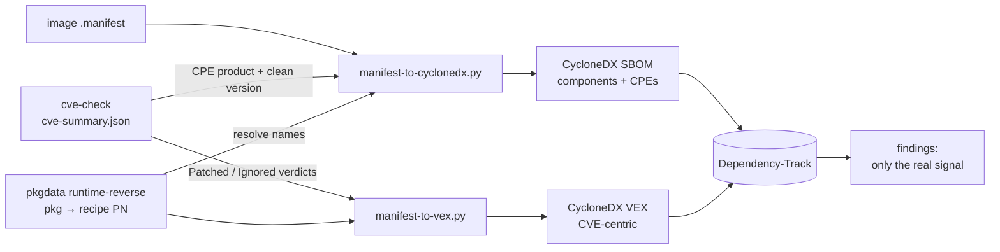

# Yocto, explained (with this repo as the running example)

## What Yocto actually is

**Yocto Project is not a Linux distro.** It's a build framework — BitBake (the
task-execution engine) plus a big pile of metadata (recipes, classes, config
files) organized into **layers** — whose job is to let you construct *your
own* distro for embedded/custom hardware. When people say "I built a custom
Yocto image," what they mean is: they used this framework to assemble one.

The pieces, concretely:

- **BitBake** — the engine. Reads recipes, resolves a dependency graph,
  executes tasks (fetch, patch, configure, compile, install, package...) in
  the right order, in parallel where possible. Analogous to `make`, but
  distro-scale and cross-compilation-first.
- **OpenEmbedded-Core (OE-Core)** — the foundational layer of metadata:
  toolchain recipes, core Unix userland, base classes almost everything else
  builds on.
- **Poky** — a *reference distribution*: BitBake + OE-Core + a default distro
  policy (`meta-poky`) + reference machines (`meta-yocto-bsp`, mostly QEMU
  targets). It's a sane, working starting point, not "the" Yocto distro.
- **Layers** (`meta-*`) — modular, stackable collections of recipes. Convention
  over configuration: everything is a layer, including your own customizations.
  In this repo, `meta-raspberrypi` is the Raspberry Pi hardware-support layer,
  and this whole repo *is* our own layer (collection name `schultz`, see
  [conf/layer.conf](../conf/layer.conf)).
- **Recipes** (`.bb` files) — build instructions for one piece of software:
  where to fetch it, how to configure/compile/install it, what it depends on,
  what license it's under. [recipes-core/images/schultz-image-minimal.bb](../recipes-core/images/schultz-image-minimal.bb)
  is a recipe — just one whose "output" is a whole root filesystem image
  instead of a single package.
- **Classes** (`.bbclass`) — shared behavior recipes inherit (`inherit
  cve-check`, `inherit systemd`, etc.) instead of repeating logic everywhere.
- **Machine config** — hardware target definition (kernel, bootloader,
  architecture tuning). `raspberrypi3-64` comes from `meta-raspberrypi`.
- **Distro config** — cross-cutting policy: init system, package manager
  format, default features. We use the stock `poky` distro
  (`DISTRO = "poky"` in [local.conf.sample](../conf/templates/schultz/local.conf.sample)).

## How you actually make a distro

Assembling a distro is choosing/writing five things, in practice:

1. **Pick your layers.** Start from OE-Core + a distro policy (Poky is the
   easy default), add a BSP layer for your hardware
   (`meta-raspberrypi`), add feature layers as needed (`meta-openembedded`
   for a much bigger package catalog, `meta-virtualization`,
   `meta-security`, hundreds more exist — browse
   [layers.openembedded.org](https://layers.openembedded.org/)).
2. **Create your own layer.** This is where *your* distro's identity lives —
   your custom recipes, your image definition, any patches/overrides to
   upstream recipes. `bitbake-layers create-layer` scaffolds one; ours was
   built by hand but the shape is the same (`conf/layer.conf` +
   `recipes-*/` directories).
3. **Pick a MACHINE.** Which hardware you're targeting — determines kernel,
   bootloader, architecture. Ours: `raspberrypi3-64`.
4. **Write an image recipe.** An image recipe is just `IMAGE_INSTALL` (what
   packages go in) plus `IMAGE_FEATURES` (feature bundles like
   `ssh-server-openssh`, `debug-tweaks`, `read-only-rootfs`). Ours extends
   `core-image-minimal` and adds SSH — see
   [schultz-image-minimal.bb](../recipes-core/images/schultz-image-minimal.bb).
   This is also where "minimal" stops being a marketing word and becomes a
   real design decision: every package you add is a package you now have to
   maintain, patch, and justify.
5. **Build and iterate.** `bitbake <image>` builds the whole thing; `devtool`
   gives you a fast edit/rebuild loop on one recipe at a time without
   rebuilding the world; `bitbake-layers show-layers`/`show-recipes` tell you
   what's actually in play. Shared state (`sstate-cache`) means rebuilds
   after the first one are fast — only what changed gets rebuilt.

The whole "is this actually available" question matters more than it sounds:
we found out the hard way that `nano`/`htop` aren't in OE-Core or
`meta-raspberrypi` — they're in `meta-openembedded`, a layer we don't have.
Every package you reference has to actually be *provided* by one of your
configured layers, or BitBake fails fast (`Nothing RPROVIDES 'x'`) rather than
silently substituting something.

## Why this is a smart way to do it

Compared to "take a general-purpose distro (Debian/Ubuntu/Raspberry Pi OS)
and strip it down" or "hand-roll a rootfs from scratch":

- **Reproducibility.** Same layers + same config + same recipes = bit-for-bit
  the same image, on any build host. No "works on my machine" for the OS
  itself.
- **Actually minimal, not diet-general-purpose.** You start from nothing and
  add only what you choose (`IMAGE_INSTALL`), rather than starting from
  everything a general distro ships and trying to delete your way to small.
  Smaller image = smaller attack surface, less to patch, less to explain.
- **Cross-compilation is the default, not an afterthought.** Build for
  `arm64`, `armv7`, `riscv64`, whatever, from any host architecture, using
  the same workflow every time.
- **License visibility is built in, not bolted on.** Every recipe declares
  `LICENSE`. Anything with a restrictive/non-free flag (like the RPi
  Wi-Fi/Bluetooth/GPU firmware we hit) requires an explicit
  `LICENSE_FLAGS_ACCEPTED` — you can't accidentally ship something whose
  license you didn't look at.
- **It's what the industry actually runs.** Automotive, networking gear,
  industrial control, most "embedded Linux products" you can name are built
  this way — meaning long-term vendor support, a large layer ecosystem, and
  transferable skills.
- **The tradeoff, honestly:** steeper learning curve than Buildroot (simpler,
  Makefile/Kconfig-based, less flexible layering) and much steeper than
  "just apt-get on Raspberry Pi OS." You're paying setup/learning cost for
  control and reproducibility. For a one-off hobby project that's a real
  cost; for anything you'll maintain for years, or need to trust, it's a
  good trade.

## Keeping it updated

Yocto ships releases on a rhythm (see the [Releases wiki](https://wiki.yoctoproject.org/wiki/Releases)):
non-LTS releases roughly every 6 months, LTS releases roughly every 4 years
with multi-year support tails. We're tracking `scarthgap` (5.0 LTS, supported
into 2028) — see [first-build.md](first-build.md) for why we ended up there
instead of the newer `wrynose` (its poky/meta-raspberrypi branches don't
exist yet, as of this writing — verify with `git ls-remote --heads` before
assuming a branch is cut).

Updating means moving **all your layers together** to matching release
branches — poky, `meta-raspberrypi`, and your own layer's
`LAYERSERIES_COMPAT` all need to agree, or BitBake will refuse to parse.
Practically: read the release's migration notes, bump branches, rebuild, fix
what breaks (recipe renames, removed classes, changed defaults do happen
between releases).

For patching *within* a release rather than jumping releases:

- Recipes pin exact versions (`PV`) and often exact source revisions
  (`SRCREV`) — nothing moves under you silently. Getting a fix means someone
  (upstream layer maintainers, or you) bumps that pin.
- `devtool upgrade <recipe>` automates a lot of the "bump version, refresh
  patches, see what broke" cycle for one recipe at a time.
- The upstream Yocto/OE-Core and `meta-raspberrypi` projects continuously
  backport fixes to their LTS branches — `git pull` on those layers
  periodically, not just at major-version-jump time.

## Safe and secure, concretely

- **`inherit cve-check`** — a standard OE-Core class that cross-references
  every recipe's version against the NVD CVE database and reports known
  vulnerabilities per-package at build time (`tmp/deploy/cve/` reports).
  This is the single most useful "am I shipping something known-bad" check
  and it's not extra tooling to bolt on, it's already in the framework.
- **Minimal `IMAGE_INSTALL` = minimal attack surface**, by construction, not
  by after-the-fact hardening. Nothing is running or installed that you
  didn't explicitly ask for.
- **`LICENSE_FLAGS_ACCEPTED`** forces a conscious decision before anything
  non-free/restrictively-licensed ships — you can't silently end up
  distributing something you haven't reviewed.
- **`IMAGE_FEATURES += "read-only-rootfs"`** is available when you're ready
  for it — a read-only root filesystem meaningfully limits what a runtime
  compromise can persist or tamper with. Not enabled here (this image is a
  debug/learning sandbox, deliberately loose via `debug-tweaks`), but it's a
  one-line feature away for anything closer to production.
- **Reproducible builds** double as a supply-chain check: if you can rebuild
  the same inputs and get the same output, you have a real basis for
  verifying "what's actually in this image" rather than trusting a binary
  blob.
- **Deeper topics that exist but aren't set up here** (worth knowing the
  names for later): secure boot / verified boot chains, `meta-secure-core`,
  dm-verity/IMA integrity measurement, signed package feeds. All real,
  all more involved than this learning project needs yet.

## Fitting into a real toolchain: git, Nexus, Dependency-Track

### Git — it's already doing more than you think

Beyond hosting our layer, git is also the fetch mechanism for a big chunk of
*upstream* source: most recipes use `SRC_URI = "git://...;branch=..."` with a
pinned `SRCREV`, so a huge amount of what BitBake fetches is a git operation
under the hood, version-pinned per recipe.

Managing many layers (each its own git repo, each needing a matching release
branch) gets painful with raw submodules. The community answer is
**[kas](https://kas.readthedocs.io/)** — a YAML manifest that declares your
layers, branches, and patches, and sets up the whole build environment in one
command. `meta-raspberrypi` ships its own `kas-poky-rpi.yml` for exactly this
reason. Google's `repo` tool (Android-style multi-repo manifests) is the
other common option. Worth adopting once you're juggling more than 2-3
layers — not needed yet here.

What deliberately stays *out* of git either way: `build/`, `downloads/`,
`sstate-cache/`, `tmp/` — huge, host-specific, and fully reproducible from
recipes + config. Already in [.gitignore](../.gitignore).

### Nexus — shared caches and artifact storage

(Artifactory was evaluated first and rejected — Java-only on the free tier,
and its Bintray-based install docs point at long-dead infrastructure. Nexus
Repository CE turned out to be the practical choice for a home-lab; if you
already run Artifactory elsewhere, the same two BitBake variables apply.)

Two BitBake variables turn Nexus (or Artifactory, or any generic HTTP repo)
into shared build infrastructure instead of a place to dump files:

- **`SSTATE_MIRRORS`** — point it at a generic Nexus raw-hosted repo and
  every build host/CI runner can fetch pre-built task outputs (compiled
  `gcc-cross`, `glibc`, etc.) instead of rebuilding them. This is the same
  idea as Yocto's own public sstate mirror
  (the `core/yocto/sstate-mirror-cdn` fragment in the new `bitbake-setup`
  tool enables exactly this, pointed at `sstate.yoctoproject.org`) — you'd
  just point at your own Nexus instance instead.
- **`SOURCE_MIRROR_URL` / `PREMIRRORS`** — mirror upstream source tarballs.
  Protects you when an upstream project deletes a tag or goes offline
  mid-project (it happens), and is faster than re-fetching from the public
  internet every time.

This is now real, not just templated: [scripts/setup-nexus-mirror.sh](../scripts/setup-nexus-mirror.sh)
creates the two raw-hosted repos (`yocto-sources-raw`, `yocto-sstate-raw`)
via Nexus's REST API, and both variables are active (uncommented) in
[local.conf.sample](../conf/templates/schultz/local.conf.sample), pointed at
a Nexus instance on the local network. One known rough edge: BitBake's
`BB_HASHSERVE` (on by default) isn't fully compatible with `SSTATE_MIRRORS`
— logs a warning, doesn't block builds, low priority to fix while the
mirror is still lightly populated.

Beyond mirrors, Nexus's format-aware repo types (Debian, RPM, apt) can host
an actual package feed if you ever want field updates via `opkg`/`apt`
instead of full image re-flashes — and its raw/generic repos are a normal
place to publish the final `.wic.bz2` images as versioned release
artifacts, same as any other build output.

### Dependency-Track — this one's real now, not just described

Recent Yocto releases generate a full **SPDX SBOM by default**, no
configuration needed (the `create-spdx` class is in `INHERIT_DISTRO` out of
the box). Once `schultz-image-minimal` finishes building, there's an SPDX
document sitting at
`tmp/deploy/images/raspberrypi3-64/schultz-image-minimal-raspberrypi3-64.spdx.json`
— but it turns out that file is a red herring for feeding Dependency-Track:

- **Dependency-Track's `/api/v1/bom` endpoint is CycloneDX-only.** Verified
  against the source (`CycloneDxValidator.java`) and empirically (raw SPDX
  gets a bare `HTTP 400 Unable to determine schema version from JSON`) — it
  never even attempts SPDX parsing, on v4.13 *or* the current v5.0.2.
- Yocto's own SPDX output is also not one flat document — it's a graph of
  166+ linked files (one per recipe, joined by `externalDocumentRefs`).
  Converting just the top-level document (e.g. via `cyclonedx-cli convert
  --input-format spdxjson`) only captures the image itself as a single
  fake "component", none of the real packages.

So the real pipeline **doesn't** touch the `.spdx.json` at all. Instead,
[scripts/manifest-to-cyclonedx.py](../scripts/manifest-to-cyclonedx.py)
generates a minimal, valid CycloneDX **1.6** JSON document directly from
Yocto's plain-text `.manifest` file (`<name> <arch> <version>` per line,
emitted by every image build regardless of SPDX settings), using generic
`pkg:generic/<name>@<version>` PURLs — there's no ecosystem-specific PURL
type for Yocto/OE packages, so Dependency-Track's ecosystem-aware version
matching (Alpine/Debian/Go/Maven/NPM/PyPI/RPM) can't kick in. On their own,
those generic PURLs made DT find **exactly zero** CVEs — nothing lines them
up against NVD. Two more moves fix that: CPE enrichment (so DT finds the real
CVEs) and a VEX round-trip (so it drops the ones Yocto already fixed), both
detailed below.

[scripts/upload-sbom.sh](../scripts/upload-sbom.sh) does the upload (reads
`DTRACK_URL`/`DTRACK_API_KEY` from the environment, strips whitespace from
the key first — mind the trailing-newline-in-API-key gotcha, it produces a
bare 400 with no body, easy to mistake for an auth failure). It also checks
the actual HTTP status before declaring success — `curl` doesn't fail on
4xx/5xx without `-f`, so a naive script can print "Uploaded successfully"
on a real rejection. `remote-build.sh` auto-runs the upload after a
successful build via `scripts/run-build-and-report.sh`, but only if
`DTRACK_URL` is set (sourced from a gitignored `keys/dtrack.env` sibling
directory, same convention as the RAUC signing keys) — leave it unset and
nothing changes. Verified end-to-end against both Dependency-Track v4.13.0
and v5.0.2: 83/83 real packages land as components, fully processed through
internal vulnerability analysis.

The generic-PURL SBOM gets the package list into DT, but DT can't match a
generic PURL against NVD — so the story has two more steps, both driven by the
same `cve-check` data: feeding it *into* the SBOM (as CPEs), then reading its
verdicts *back out* as a VEX.

#### Step 1 — CPE enrichment: making DT find the real CVEs

`cve-check` already does the hard part of Yocto→NVD identity: for every recipe,
its `cve-summary.json` records the **CPE product** name it matched against NVD
(`products[].product`) plus the clean upstream version. So
`manifest-to-cyclonedx.py` attaches a real CPE to each component:
`cpe:2.3:a:*:<product>:<version>:*:*:*:*:*:*:*`. Two deliberate choices:

- **Vendor is left as ANY (`*`).** NVD vendors are inconsistent (glibc's vendor
  is `gnu`, and so is bash's), and getting one wrong means *no* match. An
  ANY-vendor CPE matches regardless — verified that DT honours it.
- **The CPE version is cve-check's clean upstream version** (`1.36.1`), while
  the component's own `version` keeps the manifest's `-r0` PR suffix
  (`1.36.1-r0`). NVD matches on the CPE, so the CPE has to carry the version
  NVD understands.

The one wrinkle is names: the manifest lists *runtime package* names
(`libssl3`, `libc6`, `libcurl4`) but cve-check keys on *recipe* names
(`openssl`, `glibc`, `curl`). `tmp/pkgdata/.../runtime-reverse/<pkg>` has a
`PN:` line that is the authoritative package→recipe map; the resolver uses that
first, then an exact-name match, then longest recipe-name-prefix. Result:
**81 of 83 components get a CPE** (the two that don't are `packagegroup-*`
meta-packages with no compiled content), and DT's finding count went from
**0 to ~100**. Those ~100 are real NVD matches against the versions in the image.

#### Step 2 — the VEX round-trip: making DT drop the false positives

~100 findings sounds alarming, but most are false positives, and it's Yocto's
own doing in a good way: Yocto **backports** security fixes without bumping the
upstream version. The shipped `busybox` is still `1.36.1`, its CPE still
matches NVD's "vulnerable ≤ 1.36.x" range, and DT dutifully flags a CVE that
was actually patched at build time. `cve-check` already knows the truth
per-CVE (`Patched` / `Ignored` / `Unpatched`) — the job is to hand that verdict
to DT so it stops crying wolf. That is exactly what a **VEX** (Vulnerability
Exploitability eXchange) is for. [manifest-to-vex.py](../scripts/manifest-to-vex.py)
maps each verdict:

| cve-check says | VEX `analysis.state` | effect in DT |
|---|---|---|
| `Patched` | `resolved` | suppressed |
| `Ignored` — cpe-incorrect / disputed | `false_positive` | suppressed |
| `Ignored` — not-applicable-\* | `not_affected` (+ justification) | suppressed |
| `Ignored` — upstream-wontfix | `in_triage` | kept visible |
| `Unpatched` | *(omitted)* | stays active — the real signal |

The hard-won lesson was **how DT correlates a standalone VEX**, and it cost a
few rounds of "HTTP 200, zero effect." DT does **not** match a VEX's
`affects[].ref` against the per-component PURLs stored in the project. It
matches them **only against the VEX's own `metadata.component.bom-ref`** — the
single root/firmware component. So the working VEX is *CVE-centric*, not
per-component: one entry per CVE, and **every** `affects[].ref` is that same
root ref. DT maps the root to the target project via the `project` field on the
upload request and applies each verdict **project-wide, by CVE** (it suppresses
that CVE on every component carrying it). `resolved` / `not_affected` /
`false_positive` auto-suppress; `in_triage` just annotates. (DT's own VEX
*export* confirms the shape — it writes the project UUID as both the root
`bom-ref` and every `affects.ref`.)

Two consequences fall out of "project-wide by CVE":

- **Never suppress a CVE that's `Unpatched` anywhere in the image.** Because a
  verdict applies to the whole project, resolving a CVE just because it's
  patched in one recipe would also hide it on a recipe where it *isn't*. The
  generator excludes any CVE that cve-check marks `Unpatched` in even one of
  the image's recipes.
- **Scope the VEX to the image's recipes.** cve-check's summary covers the
  whole build closure (hundreds of recipes, most never shipped); a verdict for
  every one produced a 13k-entry / 5 MB VEX that DT ground on for minutes.
  Scoping to the recipes that actually produce the image's packages (the same
  pkgdata map as Step 1) cuts it to **~1,150 entries / 440 KB**, processed in
  seconds.

Ordering matters: a VEX can only annotate findings that already exist, so
[upload-sbom.sh](../scripts/upload-sbom.sh) uploads the SBOM, **polls the
processing token to completion**, *then* generates and uploads the VEX
(multipart — a 440 KB base64 body on a `curl` command line overflows the
shell's argument limit).

The measured result on one real build: **100 active findings → 46.** The 46
that remain are exactly what's worth a human's attention:

| remaining | count | what it is |
|---|---|---|
| genuinely unpatched | 38 | Yocto has no fix yet — act on these |
| upstream-wontfix (`in_triage`) | 6 | Yocto acknowledges, won't fix — kept visible on purpose |
| unknown to cve-check | 2 | new enough that DT's NVD mirror lists it but Yocto's cve-check DB doesn't yet — kept, conservatively |

And the safety check that matters most: cross-referencing every *suppressed*
finding against cve-check, **zero** genuinely-`Unpatched` CVEs were hidden.
Every dismissal also carries its cve-check reason in `analysis.detail`, so DT
shows *why* each was dropped — an auditable trail, not a silent mute.

Even wired together like this, the two tools aren't redundant: `cve-check` is a
one-shot, build-time check against NVD at the moment you build.
Dependency-Track is continuous monitoring of a *living* SBOM — it catches
CVEs disclosed against a package version *after* you already shipped it,
months later, without needing to rebuild anything. Feeding both from the
same build gives you shift-left detection *and* ongoing coverage.

## Signing and OTA updates — what's real here vs. what's still a project

This is the one area where it's worth being explicit about the line between
"scaffolded and build-verified" and "a genuine remaining project," because
some of it fundamentally can't be verified without physical hardware access.

**Actually working, verified on rpi5g16nvme:**

- `scripts/generate-signing-keys.sh` generates two independent things: a GPG
  key (`schultz-dev`) for package feed signing, and a self-signed x509
  dev cert/key pair for RAUC bundle signing. Both confirmed to actually run
  successfully (`gpg`/`openssl` are on the build host, keys land in
  `../keys/`, gitignored, script is idempotent).
- Package feed signing (`INHERIT += "sign_package_feed"` +
  `PACKAGE_FEED_GPG_NAME`) is real, standard OE-Core functionality — it
  signs the IPK repository index, not individual `.ipk` files (that's an
  IPK format limitation, not a shortcut we took; RPM has real per-package
  signing instead, via a separate `sign_rpm`/`sequoia` class). Templated,
  commented out, in `local.conf.sample`.
- `recipes-core/images/schultz-bundle.bb` is a real RAUC bundle recipe using
  the documented `inherit bundle` pattern with confirmed variable names
  (`RAUC_BUNDLE_FORMAT`, `RAUC_BUNDLE_SLOTS`, `RAUC_SLOT_rootfs`,
  `RAUC_KEY_FILE`, `RAUC_CERT_FILE`).

**Deliberately not implemented — a real project, not a config tweak:**

- RAUC's actual value (atomic, rollback-safe updates) needs A/B rootfs
  partitions and a bootloader (U-Boot) that tracks which slot to boot —
  Raspberry Pi's native firmware boot process doesn't have that state
  machine built in. This is a genuine architecture change (new `.wks`
  partition layout, U-Boot bring-up on `raspberrypi3-64`, a
  `rauc-conf.bbappend` with a real `system.conf`), not something to
  configure your way into.
- `scripts/fetch-rauc-layers.sh` (opt-in, not run yet) points at
  [meta-rauc](https://github.com/rauc/meta-rauc) and
  [meta-rauc-community](https://github.com/rauc/meta-rauc-community)'s
  `meta-rauc-raspberrypi` reference layer — a real, community-maintained
  example of exactly this integration, worth adapting from rather than
  reinventing.
- Note on branch naming: meta-rauc uses `gh_<release>` (e.g.
  `gh_scarthgap`), not plain `<release>` like poky/meta-raspberrypi —
  confirmed by checking the repo directly, another instance of "verify,
  don't assume, even for release branch names."
- The honest reason this stopped here: whether U-Boot actually boots,
  whether slot-switching actually works, whether a bad update actually
  rolls back — none of that is checkable by inspecting build logs. It
  needs a screen or serial cable on the actual Pi. That's a "you, with the
  hardware in hand" step, not something to fake confidence about. See
  [docs/serial-console.md](serial-console.md) for the actual hardware/wiring
  needed to get that access.

